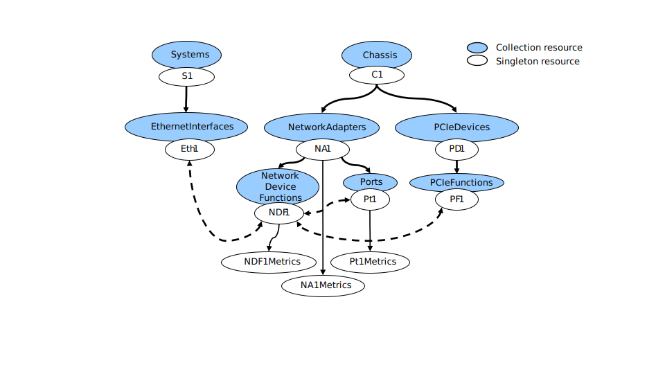

# **OCP Ethernet Network Interface Card Profile** #

***Version 1.0.0***
(Not approved yet)

# Table of Contents
[add_toc]

# Overview & Scope

This document contains the Redfish interface requirements for reporting Network Interface Card (NIC) managability information. NICs report inventory, configuration, metrics and other data using equivalent Redfish resources and properties as specified in this document.

Profile source: OCP-NIC.v1_0_0.json

Direct feedback to: jeff.hilland@hpe.com

# NIC Management Use Cases

The purpose of this profile is to ensure that common desired software use cases can be achieved using the standard API and data model contents provided by the device.  These common use cases are described below, and utilize the Redfish resources shown in the Profile Reference Guide section of this document.  Portions of the JSON payload responses are shown as examples, and are the result of HTTP GET operations performed on the supported URIs shown in the reference sections. 

## Redfish Model for NICs
Some aspects of the Redfish model should be comprehend before the interaction with the Redfish model shown below is understood.

Redfish models a managed node in terms of its physical & logical aspects:

- The physical aspect is modeled via the Chassis resource. This includes NetworkAdapter, NetworkDeviceFunction, Ports, PCIeDevice and PCIeFunction.  Some of these resources have subordinate metrics resources as well.
- The logical aspect is modeled via the ComputerSystem.  This is done using EthernetInterface and represents the System view, or logical or OS view, of the NIC. 
 
The relationship between the above resources are specified by the Links property.

- On the Chassis resource, there are links to the resources that together describe the NIC.  This includes NetworkAdapter, NetworkDeviceFunction, Ports, PCIeDevice and PCIeFunction.
- On the ComputerSystem resource, there are links to the NetworkDeviceFunction that describes the NIC.

The following diagram helps to show the relationships between these Redfish resources:
<div style="text-align: center;">

*Figure 1: Redfish NIC Hierarchy*</div>

## Retrieving Network Adapter Information

Many NICs are multi-function devices.  It is important to discover the state of the physical card, the number of Ports and their information, how many functions are on the card and PCIe information for the card and the functions.  This is begun by finding the NetworkAdapter under the Chassis.
```
	GET /redfish/v1/Chassis/1/NetworkAdapter/DE07A000
```

```json
{
    "@odata.type": "#NetworkAdapter.v1_9_0.NetworkAdapter",
    "Id": "DE07A000",
    "Name": "Network Adapter",
    "Manufacturer": "Contoso",
    "Model": "Contoso 2",
    "SKU": "Contoso 2 function adapter",
    "SerialNumber": "LMNOP4279",
    "PartNumber": "ABCDEFG2",
    "Status": {
        "Health": "OK",
        "State": "Enabled"
    },
    "Ports": {
        "@odata.id": "/redfish/v1/Chassis/1/NetworkAdapters/DE07A000/Ports"
    },
    "NetworkDeviceFunctions": {
        "@odata.id": "/redfish/v1/Chassis/1/NetworkAdapters/DE07A000/NetworkDeviceFunctions"
    },
    "Metrics": {
        "@odata.id": "/redfish/v1/Chassis/1/NetworkAdapters/DE07A000/Metrics"
    },
    "Controllers": [
        {
            "FirmwarePackageVersion": "229.1.123.0",
            "Links": {
                "PCIeDevices": [
                    {
                        "@odata.id": "/redfish/v1/Chassis/1/PCIeDevices/DE07A000"
                    }
                ]
            },
            "ControllerCapabilities": {
                "NetworkPortCount": 4,
                "NetworkDeviceFunctionCount": 16,
                "DataCenterBridging": {
                    "Capable": true
                },
                "NPAR": {
                    "NparCapable": true,
                    "NparEnabled": true
                },
                "VirtualizationOffload": {
                    "SRIOV": {
                        "SRIOVVEPACapable": true
                    },
                    "VirtualFunction": {
                        "DeviceMaxCount": 256,
                        "MinAssignmentGroupSize": 8,
                        "NetworkPortMaxCount": 256
                    }
                }
            },
            "PCIeInterface": {
                "LanesInUse": 8,
                "MaxLanes": 16,
                "MaxPCIeType": "Gen4",
                "PCIeType": "Gen4"
            }
        }
    ],
    "LLDPEnabled": true,
    "Actions": {
        "#NetworkAdapter.ResetSettingsToDefault": {
            "target": "/redfish/v1/Chassis/1/NetworkAdapters/DE07A000/Actions/NetworkAdapter.ResetSettingsToDefault",
            "@Redfish.OperationApplyTimeSupport": {
                "@odata.type": "#Settings.v1_3_3.OperationApplyTimeSupport",
                "SupportedValues": [
                    "OnReset"
                ]
            }
        }
    },
    "@odata.context": "/redfish/v1/$metadata#NetworkAdapter.NetworkAdapter", 
    "@odata.id": "/redfish/v1/Chassis/1/NetworkAdapters/DE07A000",
    "@odata.etag": "W/\"4DFAAF27\"",
    "@Redfish.Settings": {
        "@odata.type": "#Settings.v1_3_3.Settings",
        "SettingsObject": {
            "@odata.id": "/redfish/v1/Chassis/1/NetworkAdapters/DE07A000/Settings"
        },
        "SupportedApplyTimes": [
            "OnReset"
        ]
    }	
}
```


## Retriving NetworkDeviceFunction and Port information 

Also found in the Network Adapter are the NetworkDeviceFunctions and the Ports, so retrieving those are needed.  First we will get the NetworkDeviceFunction.  Note that the NetDevFuncType must equal Ethernet for this profile to apply.

```
	GET /redfish/v1/Chassis/1/NetworkAdapter/DE07A000/NetworkDeviceFunctions/1
```

```json
{
    "@odata.type": "#NetworkDeviceFunction.v1_8_0.NetworkDeviceFunction",
    "Id": "1",
    "Name": "Network Device Function 1",
    "Status": {
        "Health": "OK",
        "State": "Enabled"
    },
    "Metrics": {
        "@odata.id": "/redfish/v1/Chassis/1/NetworkAdapters/DE07A000/NetworkDeviceFunctions/1/Metrics"
    },
    "NetDevFuncType": "Ethernet",
    "DeviceEnabled": true,
    "NetDevFuncCapabilities": [
        "Ethernet"
    ],
    "Ethernet": {
        "MACAddress": "9c:dc:71:c3:bb:0a",
        "PermanentMACAddress": "9c:dc:71:c3:bb:0a",
        "MTUSizeMaximum": 9600
    },
    "BootMode": "PXE",
    "VirtualFunctionsEnabled": true,
    "MaxVirtualFunctions": 8,
    "AssignablePhysicalNetworkPorts": [
        {
            "@odata.id": "/redfish/v1/Chassis/1/NetworkAdapters/DE07A000/Ports/1"
        }
    ],
    "Links": {
        "PCIeFunction": {
            "@odata.id": "/redfish/v1/Chassis/1/PCIeDevices/DE07A000/PCIeFunctions/1"
        },
        "PhysicalNetworkPortAssignment": {
            "@odata.id": "/redfish/v1/Chassis/1/NetworkAdapters/DE07A000/Ports/1"
        },
        "EthernetInterfaces": [
            {
                "@odata.id": "/redfish/v1/Systems/1/EthernetInterfaces/5"
            }
        ]		
    },
    "@odata.context": "/redfish/v1/$metadata#NetworkDeviceFunction.NetworkDeviceFunction",
    "@odata.id": "/redfish/v1/Chassis/1/NetworkAdapters/DE07A000/NetworkDeviceFunctions/1",
    "@odata.etag": "W/\"80212509\""	
}
```

This is an example of retrieving a Port object
```
	GET /redfish/v1/Chassis/1/NetworkAdapter/DE07A000/Ports/1
```

```json
{
    "@odata.type": "#Port.v1_6_0.Port",
    "Id": "1",
    "Name": "Ethernet Port 1",
    "Status": {
        "Health": "OK",
        "State": "Enabled"
    },
    "Metrics": {
        "@odata.id": "/redfish/v1/Chassis/1/NetworkAdapters/DE07A000/Ports/1/Metrics"
    },
    "PortId": "1",
    "PortProtocol": "Ethernet",
    "PortType": "BidirectionalPort",
    "Enabled": true,
    "Ethernet": {
        "SupportedEthernetCapabilities": [
            "WakeOnLAN"
        ],
        "AssociatedMACAddresses": [
            "9c:dc:71:c3:bb:0a",
            "9c:dc:71:c3:bb:0e",
            "9c:dc:71:c3:bb:12",
            "9c:dc:71:c3:bb:16"
        ],
        "FlowControlConfiguration": "None",
        "FlowControlStatus": "None",
        "WakeOnLANEnabled": true,
        "LLDPEnabled": true,
        "LLDPReceive": {
            "ChassisId": "2c:23:3a:48:2f:5d",
            "ChassisIdSubtype": "MacAddr",
            "ManagementAddressIPv4": "",
            "ManagementAddressIPv6": "",
            "ManagementAddressMAC": "2c:23:3a:48:2f:ae",
            "ManagementVlanId": 4095,
            "PortId": "54:65:6E:2D:47:69:67:61:62:69:74:45:74:68:65:72:6E:65:74:31:2F:32:2F:39",
            "PortIdSubtype": "IfName"
        },
        "LLDPTransmit": {
            "ChassisId": "9c:dc:71:c3:bb:16",
            "ChassisIdSubtype": "MacAddr",
            "ManagementAddressIPv4": "",
            "ManagementAddressIPv6": "",
            "ManagementAddressMAC": "9c:dc:71:c3:bb:16",
            "ManagementVlanId": 4095,
            "PortId": "9C:DC:71:C3:BB:16",
            "PortIdSubtype": "MacAddr"
        }
    },
    "LinkConfiguration": [
        {
            "AutoSpeedNegotiationCapable": true,
            "AutoSpeedNegotiationEnabled": true,
            "CapableLinkSpeedGbps": [
                25.0,
                10.0
            ],
            "ConfiguredNetworkLinks": [
                {
                    "ConfiguredLinkSpeedGbps": 25.0,
                    "ConfiguredWidth": 1
                },
                {
                    "ConfiguredLinkSpeedGbps": 10.0,
                    "ConfiguredWidth": 1
                }
            ]
        }
    ],
    "LinkNetworkTechnology": "Ethernet",
    "MaxFrameSize": 9622,
    "MaxSpeedGbps": 25.0,
    "Width": 1,
    "InterfaceEnabled": true,
    "SignalDetected": true,
    "PortMedium": "Optical",
    "LinkState": "Enabled",
    "LinkStatus": "LinkUp",
    "LinkTransitionIndicator": 1,
    "CurrentSpeedGbps": 10.0,
    "ActiveWidth": 1,
    "SFP": {
        "SupportedSFPTypes": [
            "SFP",
            "SFPPlus",
            "SFP28"
        ],
        "Status": {
            "Health": "OK",
            "State": "Enabled"
        },
        "Manufacturer": "Mellanox",
        "PartNumber": "844483-B21",
        "SerialNumber": "THY1020240",
        "MediumType": "FiberOptic",
        "FiberConnectionType": "SingleMode",
        "Type": "SFP28"
    },
    "Actions": {
        "#Port.Reset": {
            "target": "/redfish/v1/Chassis/1/NetworkAdapters/DE07A000/Ports/1/Actions/Port.Reset",
            "ResetType@Redfish.AllowableValues": [
                "ForceRestart",
                "ForceOn",
                "ForceOff"
            ],
            "@Redfish.OperationApplyTimeSupport": {
                "@odata.type": "#Settings.v1_3_3.OperationApplyTimeSupport",
                "SupportedValues": [
                    "Immediate"
                ]
            }
        }
    },
	"@odata.context": "/redfish/v1/$metadata#Port.Port",
    "@odata.id": "/redfish/v1/Chassis/1/NetworkAdapters/DE07A000/Ports/1",
    "@odata.etag": "W/\"B40342B6\"",
    "@Redfish.Settings": {
        "@odata.type": "#Settings.v1_3_3.Settings",
        "SettingsObject": {
            "@odata.id": "/redfish/v1/Chassis/1/NetworkAdapters/DE07A000/Ports/1/Settings"
        },
        "SupportedApplyTimes": [
            "OnReset"
        ]
    }
}
```

## Retrieving PCIe Information

The Network Adapter is analgous to a PCIe Device, so this next retrieval gets the PCIeDevice information for the link we found in the Network Adapter.

```
	GET /redfish/v1/Chassis/1/PCIeDevices/DE07A000
```

```json
{
    "@odata.type": "#PCIeDevice.v1_9_0.PCIeDevice",
    "Id": "DE07A000",
    "Name": "PCIe Device",
    "Manufacturer": "Contoso",
    "Model": "Contoso 2",
    "SKU": "Contoso 2 function adapter",
    "SerialNumber": "LMNOP4279",
    "PartNumber": "ABCDEFG2",
    "UUID": "00000000-0000-1000-8000-9cdc71c3bb0a",
    "DeviceType": "MultiFunction",
    "FirmwareVersion": "192.168.59.0",
    "Status": {
        "Health": "OK",
        "State": "Enabled"
    },
    "PCIeFunctions": {
        "@odata.id": "/redfish/v1/Chassis/1/PCIeDevices/DE07A000/PCIeFunctions"
    },
    "PCIeInterface": {
        "LanesInUse": 8,
        "MaxLanes": 16,
        "MaxPCIeType": "Gen4",
        "PCIeType": "Gen4"
    },
    "@odata.context": "/redfish/v1/$metadata#PCIeDevice.PCIeDevice",
    "@odata.id": "/redfish/v1/Chassis/1/PCIeDevices/DE07A000",
    "@odata.etag": "W/\"70C0367C\""
}
```

The PCIeFunction information is linked to the PCIeDevice as well as the NetworkDeviceFunction so we must retrieve that information.

```
	GET /redfish/v1/Chassis/1/PCIeDevices/DE07A000/PCIeFunctions/1
```

```json
{
    "@odata.type": "#PCIeFunction.v1_3_0.PCIeFunction",
    "Id": "1",
    "Name": "PCIe Function 1",
    "FunctionType": "Physical",
    "DeviceClass": "NetworkController",
    "FunctionId": 1,
    "DeviceId": "0x1801",
    "VendorId": "0x14e4",
    "ClassCode": "0x020000",
    "RevisionId": "0x11",
    "SubsystemId": "0x1598",
    "SubsystemVendorId": "0x14e4",
    "Status": {
        "Health": "OK",
        "State": "Enabled"
    },
    "Links": {
        "NetworkDeviceFunctions": [
            {
                "@odata.id": "/redfish/v1/Chassis/1/NetworkAdapters/DE07A000/NetworkDeviceFunctions/1"
            }
        ],
        "PCIeDevice": {
            "@odata.id": "/redfish/v1/Chassis/1/PCIeDevices/DE07A000"
        }
    },
    "@odata.context": "/redfish/v1/$metadata#PCIeFunction.PCIeFunction",
    "@odata.id": "/redfish/v1/Chassis/1/PCIeDevices/DE07A000/PCIeFunctions/1",
    "@odata.etag": "W/\"2D186009\""	
}
```

## Retrieving System NIC information

EthernetInterface is the System's view of the NIC and will have constructs of what is traditionally the software stack, such as IPv4/IPv6 addresses. 

```
	GET /redfish/v1/Systems/1/EthernetInterfaces/5
```

```json
{
    "@odata.type": "#EthernetInterface.v1_4_1.EthernetInterface",
    "Id": "5",
    "FullDuplex": false,
    "IPv4Addresses": [],
    "IPv4StaticAddresses": [],
    "IPv6AddressPolicyTable": [],
    "IPv6Addresses": [],
    "IPv6StaticAddresses": [],
    "IPv6StaticDefaultGateways": [],
    "InterfaceEnabled": null,
    "LinkStatus": "LinkUp",
    "MACAddress": "9c:dc:71:c3:bb:0a",
    "Name": "",
    "NameServers": [],
    "SpeedMbps": null,
    "StaticNameServers": [],
    "Status": {
        "Health": "OK",
        "State": "Enabled"
    },
    "Links": {
        "NetworkDeviceFunctions": [
            {
                "@odata.id": "/redfish/v1/Chassis/1/NetworkAdapters/DE07A000/NetworkDeviceFunctions/1"
            }
        ]
    },
    "UefiDevicePath": "PciRoot(0x3)/Pci(0x1,0x1)/Pci(0x0,0x0)",
    "@odata.context": "/redfish/v1/$metadata#EthernetInterface.EthernetInterface",
    "@odata.etag": "W/\"C4D4ADE7\"",
    "@odata.id": "/redfish/v1/Systems/1/EthernetInterfaces/5"	
}
```

## Retrieving Metrics

# Appendix A: NIC Profile Reference Guide

To produce this guide, DMTF's [Redfish Documentation Generator](#redfish-documentation-generator) merges DMTF's Redfish Schema bundle (DSP8010) contents with supplemental text.

## Using the reference guide

Every Redfish response consists of a JSON payload containing properties that are strictly defined by a schema for that Resource.  The schema defining a particular Resource can be determined from the value of the "@odata.type" property returned in every Redfish response.  This guide details the definitions for every Redfish standard schema.

Each schema section contains:

* The schema's name, its current version, and description.
* The schema release history, which lists each minor schema version and the DSP8010 release bundle that includes it.
* The list of URIs where schema-defined Resources appear in a Redfish Service v1.6 and later.  For more information, see [URI listings](#uri-listings).
* The table of properties, which includes additional property details, when available.
* The list of available schema-defined actions.
* The example schema-defined JSON payload for a Resource.

<br>
The property-level details include:

| Column | Purpose |
| :--- | :--------- |
| Property name | <p>The case-sensitive name of the JSON property as it appears in the JSON payload.</p><p>Lists the schema version in parentheses when properties were added to or deprecated in the schema after the initial v1.0.0 release.</p> |
| Requirements | <p>The property-level read and write requirements as listed in the Redfish Profile.</p> |
| Type | <p>The JSON data types for the property, which can include boolean, number, string, or object.</p><p>The <code>string (enum)</code> tag identifies enumerated strings.</p><p>Number types that use units specify the units.</p> |
| Description | <p>The normative description of the property, as copied directly from the schema <code>LongDescription</code> definition.</p> |
