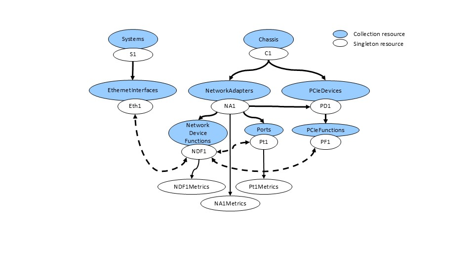

# Scope

This document contains requirements and provide usage examples for the OCP Ethernet NIC Hardware Management API v1.0.

# Requirements

The required Redfish interface model elements are specified in a corresponding profile document - OCP Ethenet NIC Profile v1.0 [4].

The Profile Reference Guide includes the resources which are part of this profile.

## Validating conformance

The conformance of an implementation can be validated by executing the Redfish Interop Validator [3] and specifying the Ethernet NIC Profile as input. The following command executes the validator.

	$> python RedfishInteropValidator.py <profileName> \--ip <host:port>

The Redfish Interop Validator is an open-source conformance test which is supported by DMTF (dmtf.org).
The validator reads the input profile, auto-generates tests, executes the tests against an implementation, and creates a test report.
Issues with the validator can be filed on the Redfish discussion board (redfishforum.com) in the
Issues with the profile can be filed on the OCP Profile repository.

# Redfish Model for NICs
Some aspects of the Redfish model should be comprehend before the interaction with the Redfish model shown below is understood.

Redfish models a managed node in terms of its physical & logical aspects:

- The physical aspect is modeled via the Chassis resource. This includes NetworkAdapter, NetworkDeviceFunction, Ports, PCIeDevice and PCIeFunction.  Some of these resources have subordinate metrics resources as well.
- The logical aspect is modeled via the ComputerSystem.  This is done using EthernetInterface and represents the System view, or logical or OS view, of the NIC. 
 
The relationship between the above resources are specified by the Links property.

- On the Chassis resource, there are links to the resources that together describe the NIC.  This includes NetworkAdapter, NetworkDeviceFunction, Ports, PCIeDevice and PCIeFunction.
- On the ComputerSystem resource, there are links to the NetworkDeviceFunction that describes the NIC.

The following diagram helps to show the relationships between these Redfish resources:
<div style="text-align: center;">

*Figure 1: Redfish NIC Hierarchy*</div>

Many NICs are multi-function devices.  It is important to discover the state of the physical card, the number of Ports and their information, how many functions are on the card and PCIe information for the card and the functions.  This is begun by finding the NetworkAdapter under the Chassis.

## Setting Information

Setting live network information is not required.  If the implementation supports setting any of the properties at the next system reset, those settings are exposed through a `Settings` object in each resource.

## Metrics

There are metrics objects on the NetworkAdapter, NetworkDeviceFunction and the Port.  

# Management Tasks

The following table lists the management tasks supported by an implementation which is conformant to the profile.

| **Use Case**          | **Management Task**                                                   | **Requirement** |
| :---                  | :-----------                                                          | :---	|
| NIC Configuration     | [Get NIC information](#get-nic-information)                           | Mandatory |
|                       | [Get device function information](#get-device-function-information)   | Mandatory |
|                       | [Get port information](#get-port-information)                         | Mandatory |
|                       | [Get PCIe information](#get-pcie-information)                         | Mandatory |
|                       | [Get PCIe function information](#get-pcie-function-information)       | Mandatory |
|                       | [Set NIC information](#set-nic-information)                           | Mandatory |
|                       | [Set device function information](#set-device-function-information)   | Mandatory |
|                       | [Set port information](#set-port-information)                         | Mandatory |
|                       | [Set NIC settings to default](#set-nic-settings-to-default)           | Mandatory |
| NIC Hardware          | [Get FRU Information](#get-fru-information)                           | Mandatory |
| System NIC            | [Get system NIC information](#get-system-nic-information)             | Mandatory |
| Telemetry             | [Get NIC metrics](#get-nic-metrics)                                   | Mandatory |
|                       | [Get device function metrics](#get-device-function-metrics)           | Mandatory |
|                       | [Get port metrics](#get-port-metrics)                                 | Mandatory |
| Firmware Update       | [Get firmware version](#get-firmware-version)                         | Mandatory |
|                       | [Update firmware](#update-firmware)                                   | Mandatory |

The section below describes the interaction with the Redfish interface to fulfill the management tasks.
In the example responses, a fragment of the full response or resource may be shown.

## Get NIC Information 

The following illustrates how to get the NetworkAdapter resource.

```
    GET /redfish/v1/Chassis/1/NetworkAdapter/DE07A000
```

```json
{
    "@odata.type": "#NetworkAdapter.v1_9_0.NetworkAdapter",
    "Id": "DE07A000",
    "Name": "Network Adapter",
    "Manufacturer": "Contoso",
    "Model": "Contoso 2",
    "SKU": "Contoso 2 function adapter",
    "SerialNumber": "LMNOP4279",
    "PartNumber": "ABCDEFG2",
    "Status": {
        "Health": "OK",
        "State": "Enabled"
    },
    "Ports": {
        "@odata.id": "/redfish/v1/Chassis/1/NetworkAdapters/DE07A000/Ports"
    },
    "NetworkDeviceFunctions": {
        "@odata.id": "/redfish/v1/Chassis/1/NetworkAdapters/DE07A000/NetworkDeviceFunctions"
    },
    "Metrics": {
        "@odata.id": "/redfish/v1/Chassis/1/NetworkAdapters/DE07A000/Metrics"
    },
    "Controllers": [
        {
            "FirmwarePackageVersion": "229.1.123.0",
            "Links": {
                "PCIeDevices": [
                    {
                        "@odata.id": "/redfish/v1/Chassis/1/PCIeDevices/DE07A000"
                    }
                ]
            },
            "ControllerCapabilities": {
                "NetworkPortCount": 4,
                "NetworkDeviceFunctionCount": 16,
                "DataCenterBridging": {
                    "Capable": true
                },
                "NPAR": {
                    "NparCapable": true,
                    "NparEnabled": true
                },
                "VirtualizationOffload": {
                    "SRIOV": {
                        "SRIOVVEPACapable": true
                    },
                    "VirtualFunction": {
                        "DeviceMaxCount": 256,
                        "MinAssignmentGroupSize": 8,
                        "NetworkPortMaxCount": 256
                    }
                }
            },
            "PCIeInterface": {
                "LanesInUse": 8,
                "MaxLanes": 16,
                "MaxPCIeType": "Gen4",
                "PCIeType": "Gen4"
            }
        }
    ],
    "LLDPEnabled": true,
    "Actions": {
        "#NetworkAdapter.ResetSettingsToDefault": {
            "target": "/redfish/v1/Chassis/1/NetworkAdapters/DE07A000/Actions/NetworkAdapter.ResetSettingsToDefault",
            "@Redfish.OperationApplyTimeSupport": {
                "@odata.type": "#Settings.v1_3_3.OperationApplyTimeSupport",
                "SupportedValues": [
                    "OnReset"
                ]
            }
        }
    },
    "@odata.context": "/redfish/v1/$metadata#NetworkAdapter.NetworkAdapter", 
    "@odata.id": "/redfish/v1/Chassis/1/NetworkAdapters/DE07A000",
    "@odata.etag": "W/\"4DFAAF27\"",
    "@Redfish.Settings": {
        "@odata.type": "#Settings.v1_3_3.Settings",
        "SettingsObject": {
            "@odata.id": "/redfish/v1/Chassis/1/NetworkAdapters/DE07A000/Settings"
        },
        "SupportedApplyTimes": [
            "OnReset"
        ]
    }	
}
```

## Get Device Function Information 

Also found in the Network Adapter are the NetworkDeviceFunctions and the Ports, so retrieving those are needed.  First we will get the NetworkDeviceFunction.  Note that the NetDevFuncType must equal Ethernet for this profile to apply.

```
    GET /redfish/v1/Chassis/1/NetworkAdapter/DE07A000/NetworkDeviceFunctions/1
```

```json
{
    "@odata.type": "#NetworkDeviceFunction.v1_8_0.NetworkDeviceFunction",
    "Id": "1",
    "Name": "Network Device Function 1",
    "Status": {
        "Health": "OK",
        "State": "Enabled"
    },
    "Metrics": {
        "@odata.id": "/redfish/v1/Chassis/1/NetworkAdapters/DE07A000/NetworkDeviceFunctions/1/Metrics"
    },
    "NetDevFuncType": "Ethernet",
    "DeviceEnabled": true,
    "NetDevFuncCapabilities": [
        "Ethernet"
    ],
    "Ethernet": {
        "MACAddress": "9c:dc:71:c3:bb:0a",
        "PermanentMACAddress": "9c:dc:71:c3:bb:0a",
        "MTUSizeMaximum": 9600
    },
    "BootMode": "PXE",
    "VirtualFunctionsEnabled": true,
    "MaxVirtualFunctions": 8,
    "AssignablePhysicalNetworkPorts": [
        {
            "@odata.id": "/redfish/v1/Chassis/1/NetworkAdapters/DE07A000/Ports/1"
        }
    ],
    "Links": {
        "PCIeFunction": {
            "@odata.id": "/redfish/v1/Chassis/1/PCIeDevices/DE07A000/PCIeFunctions/1"
        },
        "PhysicalNetworkPortAssignment": {
            "@odata.id": "/redfish/v1/Chassis/1/NetworkAdapters/DE07A000/Ports/1"
        },
        "EthernetInterfaces": [
            {
                "@odata.id": "/redfish/v1/Systems/1/EthernetInterfaces/5"
            }
        ]		
    },
    "@odata.context": "/redfish/v1/$metadata#NetworkDeviceFunction.NetworkDeviceFunction",
    "@odata.id": "/redfish/v1/Chassis/1/NetworkAdapters/DE07A000/NetworkDeviceFunctions/1",
    "@odata.etag": "W/\"80212509\""	
}
```

## Get Port Information 

This is an example of retrieving a Port object
```
    GET /redfish/v1/Chassis/1/NetworkAdapter/DE07A000/Ports/1
```

```json
{
    "@odata.type": "#Port.v1_6_0.Port",
    "Id": "1",
    "Name": "Ethernet Port 1",
    "Status": {
        "Health": "OK",
        "State": "Enabled"
    },
    "Metrics": {
        "@odata.id": "/redfish/v1/Chassis/1/NetworkAdapters/DE07A000/Ports/1/Metrics"
    },
    "PortId": "1",
    "PortProtocol": "Ethernet",
    "PortType": "BidirectionalPort",
    "Enabled": true,
    "Ethernet": {
        "SupportedEthernetCapabilities": [
            "WakeOnLAN"
        ],
        "AssociatedMACAddresses": [
            "9c:dc:71:c3:bb:0a",
            "9c:dc:71:c3:bb:0e",
            "9c:dc:71:c3:bb:12",
            "9c:dc:71:c3:bb:16"
        ],
        "FlowControlConfiguration": "None",
        "FlowControlStatus": "None",
        "WakeOnLANEnabled": true,
        "LLDPEnabled": true,
        "LLDPReceive": {
            "ChassisId": "2c:23:3a:48:2f:5d",
            "ChassisIdSubtype": "MacAddr",
            "ManagementAddressIPv4": "",
            "ManagementAddressIPv6": "",
            "ManagementAddressMAC": "2c:23:3a:48:2f:ae",
            "ManagementVlanId": 4095,
            "PortId": "54:65:6E:2D:47:69:67:61:62:69:74:45:74:68:65:72:6E:65:74:31:2F:32:2F:39",
            "PortIdSubtype": "IfName"
        },
        "LLDPTransmit": {
            "ChassisId": "9c:dc:71:c3:bb:16",
            "ChassisIdSubtype": "MacAddr",
            "ManagementAddressIPv4": "",
            "ManagementAddressIPv6": "",
            "ManagementAddressMAC": "9c:dc:71:c3:bb:16",
            "ManagementVlanId": 4095,
            "PortId": "9C:DC:71:C3:BB:16",
            "PortIdSubtype": "MacAddr"
        }
    },
    "LinkConfiguration": [
        {
            "AutoSpeedNegotiationCapable": true,
            "AutoSpeedNegotiationEnabled": true,
            "CapableLinkSpeedGbps": [
                25.0,
                10.0
            ],
            "ConfiguredNetworkLinks": [
                {
                    "ConfiguredLinkSpeedGbps": 25.0,
                    "ConfiguredWidth": 1
                },
                {
                    "ConfiguredLinkSpeedGbps": 10.0,
                    "ConfiguredWidth": 1
                }
            ]
        }
    ],
    "LinkNetworkTechnology": "Ethernet",
    "MaxFrameSize": 9622,
    "MaxSpeedGbps": 25.0,
    "Width": 1,
    "InterfaceEnabled": true,
    "SignalDetected": true,
    "PortMedium": "Optical",
    "LinkState": "Enabled",
    "LinkStatus": "LinkUp",
    "LinkTransitionIndicator": 1,
    "CurrentSpeedGbps": 10.0,
    "ActiveWidth": 1,
    "SFP": {
        "SupportedSFPTypes": [
            "SFP",
            "SFPPlus",
            "SFP28"
        ],
        "Status": {
            "Health": "OK",
            "State": "Enabled"
        },
        "Manufacturer": "Contoso",
        "PartNumber": "844483-B21",
        "SerialNumber": "THY1020240",
        "MediumType": "FiberOptic",
        "FiberConnectionType": "SingleMode",
        "Type": "SFP28"
    },
    "@odata.context": "/redfish/v1/$metadata#Port.Port",
    "@odata.id": "/redfish/v1/Chassis/1/NetworkAdapters/DE07A000/Ports/1",
    "@odata.etag": "W/\"B40342B6\"",
    "@Redfish.Settings": {
        "@odata.type": "#Settings.v1_3_3.Settings",
        "SettingsObject": {
            "@odata.id": "/redfish/v1/Chassis/1/NetworkAdapters/DE07A000/Ports/1/Settings"
        },
        "SupportedApplyTimes": [
            "OnReset"
        ]
    }
}
```

## Get PCIe Information 

The Network Adapter is analgous to a PCIe Device, so this next retrieval gets the PCIeDevice information for the link we found in the Network Adapter.

```
    GET /redfish/v1/Chassis/1/PCIeDevices/DE07A000
```

```json
{
    "@odata.type": "#PCIeDevice.v1_9_0.PCIeDevice",
    "Id": "DE07A000",
    "Name": "PCIe Device",
    "Manufacturer": "Contoso",
    "Model": "Contoso 2",
    "SKU": "Contoso 2 function adapter",
    "SerialNumber": "LMNOP4279",
    "PartNumber": "ABCDEFG2",
    "UUID": "00000000-0000-1000-8000-9cdc71c3bb0a",
    "DeviceType": "MultiFunction",
    "FirmwareVersion": "192.168.59.0",
    "Status": {
        "Health": "OK",
        "State": "Enabled"
    },
    "PCIeFunctions": {
        "@odata.id": "/redfish/v1/Chassis/1/PCIeDevices/DE07A000/PCIeFunctions"
    },
    "PCIeInterface": {
        "LanesInUse": 8,
        "MaxLanes": 16,
        "MaxPCIeType": "Gen4",
        "PCIeType": "Gen4"
    },
    "@odata.context": "/redfish/v1/$metadata#PCIeDevice.PCIeDevice",
    "@odata.id": "/redfish/v1/Chassis/1/PCIeDevices/DE07A000",
    "@odata.etag": "W/\"70C0367C\""
}
```
## Get PCIe Function Information 

The PCIeFunction information is linked to the PCIeDevice as well as the NetworkDeviceFunction so we must retrieve that information.

```
    GET /redfish/v1/Chassis/1/PCIeDevices/DE07A000/PCIeFunctions/1
```

```json
{
    "@odata.type": "#PCIeFunction.v1_3_0.PCIeFunction",
    "Id": "1",
    "Name": "PCIe Function 1",
    "FunctionType": "Physical",
    "DeviceClass": "NetworkController",
    "FunctionId": 1,
    "DeviceId": "0x1801",
    "VendorId": "0x14e4",
    "ClassCode": "0x020000",
    "RevisionId": "0x11",
    "SubsystemId": "0x1598",
    "SubsystemVendorId": "0x14e4",
    "Status": {
        "Health": "OK",
        "State": "Enabled"
    },
    "Links": {
        "NetworkDeviceFunctions": [
            {
                "@odata.id": "/redfish/v1/Chassis/1/NetworkAdapters/DE07A000/NetworkDeviceFunctions/1"
            }
        ],
        "PCIeDevice": {
            "@odata.id": "/redfish/v1/Chassis/1/PCIeDevices/DE07A000"
        }
    },
    "@odata.context": "/redfish/v1/$metadata#PCIeFunction.PCIeFunction",
    "@odata.id": "/redfish/v1/Chassis/1/PCIeDevices/DE07A000/PCIeFunctions/1",
    "@odata.etag": "W/\"2D186009\""	
}
```

## Get System NIC information

EthernetInterface is the System's view of the NIC and will have constructs of what is traditionally the software stack, such as IPv4/IPv6 addresses. 

```
    GET /redfish/v1/Systems/1/EthernetInterfaces/5
```

```json
{
    "@odata.type": "#EthernetInterface.v1_4_1.EthernetInterface",
    "Id": "5",
    "FullDuplex": false,
    "IPv4Addresses": [],
    "IPv4StaticAddresses": [],
    "IPv6AddressPolicyTable": [],
    "IPv6Addresses": [],
    "IPv6StaticAddresses": [],
    "IPv6StaticDefaultGateways": [],
    "InterfaceEnabled": null,
    "LinkStatus": "LinkUp",
    "MACAddress": "9c:dc:71:c3:bb:0a",
    "Name": "",
    "NameServers": [],
    "SpeedMbps": null,
    "StaticNameServers": [],
    "Status": {
        "Health": "OK",
        "State": "Enabled"
    },
    "Links": {
        "NetworkDeviceFunctions": [
            {
                "@odata.id": "/redfish/v1/Chassis/1/NetworkAdapters/DE07A000/NetworkDeviceFunctions/1"
            }
        ]
    },
    "UefiDevicePath": "PciRoot(0x3)/Pci(0x1,0x1)/Pci(0x0,0x0)",
    "@odata.context": "/redfish/v1/$metadata#EthernetInterface.EthernetInterface",
    "@odata.etag": "W/\"C4D4ADE7\"",
    "@odata.id": "/redfish/v1/Systems/1/EthernetInterfaces/5"	
}
```

## Set NIC Information

The previous GETs returned the following properties.  By performing a GET operation on that URI, the client can determine what properties can be changed and can set them by performing a PUT or PATCH operation on that resource.

```json
    "@Redfish.Settings": {
        "@odata.type": "#Settings.v1_3_3.Settings",
        "SettingsObject": {
            "@odata.id": "/redfish/v1/Chassis/1/NetworkAdapters/DE07A000/Settings"
        },
        "SupportedApplyTimes": [
            "OnReset"
        ]
    }	
```

## Set Device Function Information

The previous GETs returned the following properties.  By performing a GET operation on that URI, the client can determine what properties can be changed and can set them by performing a PUT or PATCH operation on that resource.

```json
    "@Redfish.Settings": {
        "@odata.type": "#Settings.v1_3_3.Settings",
        "SettingsObject": {
            "@odata.id": "/redfish/v1/Chassis/1/NetworkAdapters/DE07A000/NetworkDeviceFUnctions/1/Settings"
        },
        "SupportedApplyTimes": [
            "OnReset"
        ]
    }	
```

## Set Port Information

The previous GETs returned the following properties.  By performing a GET operation on that URI, the client can determine what properties can be changed and can set them by performing a PUT or PATCH operation on that resource.

```json
    "@Redfish.Settings": {
        "@odata.type": "#Settings.v1_3_3.Settings",
        "SettingsObject": {
            "@odata.id": "/redfish/v1/Chassis/1/NetworkAdapters/DE07A000/Ports/1/Settings"
        },
        "SupportedApplyTimes": [
            "OnReset"
        ]
    }
```

## Get NIC Metrics

As the NetworkAdapter resouce represents the card, or PCIe device, it will have some global metrics that correspond to the device.  

```
    GET /redfish/v1/Chassis/1/NetworkAdapters/DE07A000/Metrics
```

```json
{
    "@odata.type": "#NetworkAdapterMetrics.v1_0_0.NetworkAdapterMetrics",
    "Id": "Metrics",
    "Name": "Network Adapter Metrics",
    "NCSIRXBytes": 20250,
    "NCSIRXFrames": 450,
    "NCSITXBytes": 16168,
    "NCSITXFrames": 450,
    "RXBytes": 1411160,
    "RXUnicastFrames": 9,
    "RXMulticastFrames": 6506,
    "TXBytes": 12179,
    "TXUnicastFrames": 0,
    "TXMulticastFrames": 69,
    "@odata.context": "/redfish/v1/$metadata#NetworkAdapterMetrics.NetworkAdapterMetrics",
    "@odata.id": "/redfish/v1/Chassis/1/NetworkAdapters/DE07A000/Metrics",
    "@odata.etag": "W/\"B85BFB25\""	
}
```

## Get Device Function Metrics

For any individual PCIe or virtual function, those metrics can be found on the NetworkDeviceFunctionMetrics.

```
    GET /redfish/v1/Chassis/1/NetworkAdapters/DE082000/NetworkDeviceFunctions/0/Metrics
```

```json
{
    "@odata.type": "#NetworkDeviceFunctionMetrics.v1_1_0.NetworkDeviceFunctionMetrics",
    "Id": "Metrics",
    "Name": "Network Device Function 1 Metrics",
    "RXBytes": 286683,
    "RXFrames": 1867,
    "RXUnicastFrames": 0,
    "RXMulticastFrames": 1,
    "TXBytes": 0,
    "TXFrames": 0,
    "TXUnicastFrames": 0,
    "TXMulticastFrames": 0,
    "@odata.context": "/redfish/v1/$metadata#NetworkDeviceFunctionMetrics.NetworkDeviceFunctionMetrics",
    "@odata.id": "/redfish/v1/Chassis/1/NetworkAdapters/DE07A000/NetworkDeviceFunctions/1/Metrics",
    "@odata.etag": "W/\"7BD1348E\""	
}
```

## Get Port Metrics

Any metrics on the port itself are represented by the PortMetrics object. 

```
    GET /redfish/v1/Chassis/1/NetworkAdapters/DE07A000/Ports/1/Metrics
```

```json
{
    "@odata.type": "#PortMetrics.v1_2_0.PortMetrics",
    "Id": "Metrics",
    "Name": "Ethernet Port 1 Metrics",
    "Networking": {
        "RXFrames": 8519,
        "RXUnicastFrames": 9,
        "RXMulticastFrames": 6467,
        "RXBroadcastFrames": 2043,
        "RXPFCFrames": 0,
        "RXDiscards": 0,
        "RXFalseCarrierErrors": 0,
        "RXFCSErrors": 0,
        "RXFrameAlignmentErrors": 0,
        "RXOversizeFrames": 0,
        "RXUndersizeFrames": 0,
        "TXFrames": 69,
        "TXUnicastFrames": 0,
        "TXMulticastFrames": 69,
        "TXBroadcastFrames": 0,
        "TXPFCFrames": 0,
        "TXDiscards": 0,
        "TXExcessiveCollisions": 0,
        "TXLateCollisions": 0,
        "TXMultipleCollisions": 0,
        "TXSingleCollisions": 0
    },
    "RXBytes": 1401596,
    "RXErrors": 169,
    "TXBytes": 12179,
    "TXErrors": 0,
    "Transceivers": [
        {
            "RXInputPowerMilliWatts": 6985.0,
            "SupplyVoltage": 52096.0,
            "TXBiasCurrentMilliAmps": 3375.0,
            "TXOutputPowerMilliWatts": 7108.0
        }
    ],
    "@odata.context": "/redfish/v1/$metadata#PortMetrics.PortMetrics",
    "@odata.id": "/redfish/v1/Chassis/1/NetworkAdapters/DE07A000/Ports/1/Metrics",
    "@odata.etag": "W/\"4E6105EA\""	
}
```

## Set NIC Settings To Default

In order to reset the settings to default, there is a required action called `ResetSettingsToDefault`.  This action takes no paramaters. It is invoked as follows:

```
    POST /redfish/v1/Chassis/1/NetworkAdapter/DE07A000/Actions/NetworkAdapter.ResetSettingsToDefault
```

## Get FRU Information

FRU information is found on the NetworkAdapter. The properties Manufacturer, Model, SKU and SerialNumber are all required properties.   For more information, see [GET NetworkAdapter](#get-networkadapter). 

```
    GET /redfish/v1/Chassis/1/NetworkAdapter/DE07A000
```

```json
{
    "Manufacturer": "Contoso",
    "Model": "Contoso 2",
    "SKU": "Contoso 2 function adapter",
    "SerialNumber": "LMNOP4279",
    "PartNumber": "ABCDEFG2"
}
```

## Get Firmware Version

Like FRU, the firmware version can be found on the NetworkAdapter object under the FirmwarePackageVersion property.  This is a required property.  For more information, see [GET NetworkAdapter](#get-networkadapter). 

```
    GET /redfish/v1/Chassis/1/NetworkAdapter/DE07A000
```

```json
{
    "FirmwarePackageVersion": "1.2.3"
}
```

## Update Firmware

Updating firmware is done via the Redfish UpdateService.  The following is an example of how to update firmware on a NetworkAdapter using HTTP multipart.
The Redfish Firmware Update White Paper [5] describes the firmware update process and options.

```
POST /redfish/v1/UpdateService/upload HTTP/1.1
Host: <host-path>
Content-Type: multipart/form-data; boundary=---------------------------e67f97b6546ac967b
Content-Length: <computed-length>
Connection: keep-alive
X-Auth-Token: <session-auth-token>

-----------------------------e67f97b6546ac967b
Content-Disposition: form-data; name="UpdateParameters"
Content-Type: application/json

{
   "Targets": ["/redfish/v1/Chassis/1/NetworkAdapter/DE07A000"],
   "@Redfish.OperationApplyTime": "OnReset"
}

-----------------------------e67f97b6546ac967b
Content-Disposition: form-data; name="UpdateFile"; filename="firmwareimage.bin"
Content-Type: application/octet-stream

<software image binary>
```

# References

\[1\] "[Redfish API Specification](https://www.dmtf.org/dsp/DSP0266)"

\[2\] "[Redfish Data Model Specification](https://www.dmtf.org/dsp/DSP0268)"

\[3\] "[Redfish Interop Validator](https://github.com/DMTF/Redfish-Interop-Validator)"

\[4\] "[Ethernet NIC Profile v1.0](https://github.com/opencomputeproject/HWMgmt-OCP-Profiles/blob/nicdoc/EthernetNIC/OCP_NIC.v1_0_0.json)"

\[5\] "[Redfish Firmware Update White Paper](https://www.dmtf.org/dsp/DSP2062)

# Revision 

| **Revision**  | **Date**      | **Description** |
| :---          | :---          | :--- |
| 1.0           | 4/20/2025     | Initial contribution |
