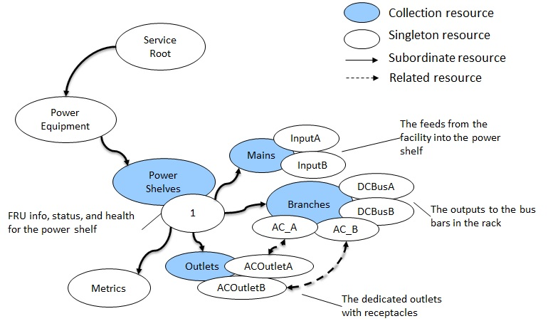
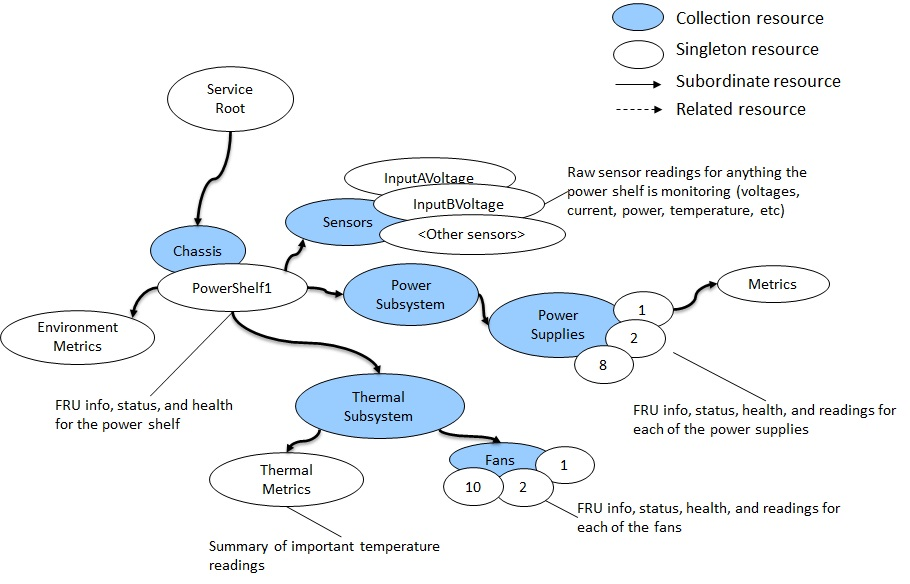

# Version History

| **Date**  | **Version** | **Author** | **Description** |
| :---      | :---: | :---:      | :--- |
| TBD | 1.0.0 | Michael Raineri | Initial usage guide and profile contribution |

# License
This work is licensed under a [Creative Commons Attribution-ShareAlike 4.0 International License](https://creativecommons.org/licenses/by-sa/4.0/).


NOTWITHSTANDING THE FOREGOING LICENSES, THIS SPECIFICATION IS PROVIDED BY OCP "AS IS" AND OCP EXPRESSLY DISCLAIMS ANY WARRANTIES (EXPRESS, IMPLIED, OR OTHERWISE), INCLUDING IMPLIED WARRANTIES OF MERCHANTABILITY, NON-INFRINGEMENT, FITNESS FOR A PARTICULAR PURPOSE, OR TITLE, RELATED TO THE SPECIFICATION. NOTICE IS HEREBY GIVEN, THAT OTHER RIGHTS NOT GRANTED AS SET FORTH ABOVE, INCLUDING WITHOUT LIMITATION, RIGHTS OF THIRD PARTIES WHO DID NOT EXECUTE THE ABOVE LICENSES, MAY BE IMPLICATED BY THE IMPLEMENTATION OF OR COMPLIANCE WITH THIS SPECIFICATION. OCP IS NOT RESPONSIBLE FOR IDENTIFYING RIGHTS FOR WHICH A LICENSE MAY BE REQUIRED IN ORDER TO IMPLEMENT THIS SPECIFICATION. THE ENTIRE RISK AS TO IMPLEMENTING OR OTHERWISE USING THE SPECIFICATION IS ASSUMED BY YOU. IN NO EVENT WILL OCP BE LIABLE TO YOU FOR ANY MONETARY DAMAGES WITH RESPECT TO ANY CLAIMS RELATED TO, OR ARISING OUT OF YOUR USE OF THIS SPECIFICATION, INCLUDING BUT NOT LIMITED TO ANY LIABILITY FOR LOST PROFITS OR ANY CONSEQUENTIAL, INCIDENTAL, INDIRECT, SPECIAL OR PUNITIVE DAMAGES OF ANY CHARACTER FROM ANY CAUSES OF ACTION OF ANY KIND WITH RESPECT TO THIS SPECIFICATION, WHETHER BASED ON BREACH OF CONTRACT, TORT (INCLUDING NEGLIGENCE), OR OTHERWISE, AND EVEN IF OCP HAS BEEN ADVISED OF THE POSSIBILITY OF SUCH DAMAGE.

# Scope

This document contains requirements and provides the usage examples for the OCP Power Shelf API v1.0.0.

# Requirements

As a Redfish-based interface, the required Redfish interface model elements are specified in a profile document.
For the OCP Power Shelf API v1.0.0, the profile is located at: https://github.com/opencomputeproject/HWMgmt-OCP-Profiles/blob/master/OCPPowerShelf.v1_0_0.json

The [Redfish Interop Validator](#interop-validator) is an open-source conformance test that reads the profile, executes the tests against an implementation, and generates a test report in text or HTML format.

```
> rf_interop_validator -u user -p password -r host:port profileName
```

The OCP Power Shelf v1.0.0 profile extends from the OCP Service Baseline v1.0.0 profile.
This extension is specified directly in the profile.
This means that the specification requires conformance to the OCP Service Baseline profile in addition to any requirements specified in the OCP Power Shelf profile.

```
"RequiredProfiles": {
    "OCPBaselineRedfishService": {
        "MinVersion": "1.0.0"
    }
},
```

# Capabilities

The following use cases are enabled by conformance to this OCP Power Shelf profile.
The OCP Power Shelf profile is extended from the OCP Service Baseline profile.
For capabilities specified in the the OCP Service Baseline profile, see the "OCP Service Baseline Usage Guide".

The following table lists the capabilities prescribed in the OCP Power Shelf profile.

| Use Case             | Management Task                                             | Requirement |
| :---                 | :---------                                                  | :---        |
| Power                | [Get power supply info](#get-the-power-supply-info)         | Mandatory |
|                      | [Get power supply redundancy](#get-power-supply-redundancy) | If implemented, mandatory |
|                      | [Get power supply metrics](#get-power-supply-metrics)       | Mandatory |
|                      | [Set power supply LED](#set-power-supply-led)               | Mandatory |
|                      | [Get power consumption](#get-power-consumption)             | Mandatory |
| Temperature          | [Get the temperature](#get-the-temperature)                 | If implemented, mandatory |
| Power equipment      | [Get power shelf info](#get-power-shelf-info)               | Mandatory |
|                      | [Get power shelf metrics](#get-power-shelf-metrics)         | Mandatory |
|                      | [Set power shelf LED](#set-power-shelf-led)                 | Mandatory |
|                      | [Get mains circuits](#get-main-circuits)                    | Mandatory |
|                      | [Get branch circuits](#get-branch-circuits)                 | Mandatory |
|                      | [Get outlets](#get-outlets)                                 | If implemented, mandatory |

Figure 1 shows a diagram of the power distribution unit model for a power shelf, which represents the functional view of the power shelf.
Figure 2 shows a diagram of the chassis model for a power shelf, which represents the physical view of the power shelf.

|  |
| :--------: |
| *Figure 1* |

|  |
| :--------: |
| *Figure 2* |

Refer to the following sections of the [*Redfish Data Model Specification*](#dsp0268) for the Redfish schema definitions for the previous use cases:

* Power: `PowerSubsystem`, `PowerSupply`, `PowerSupplyMetrics`, and `EnvironmentMetrics` sections.
* Temperature: `EnvironmentMetrics` section.
* Power equipment: `PowerEquipment`, `PowerDistribution`, `PowerDistributionMetrics`, `Circuit`, and `Outlet` sections.

# Use Cases

This section describes how each capability is accomplished by interacting with the Redfish service.

## Get the power supply info

To access power supply information, perform a `GET` operation on a `PowerSupply` resource:

```http
GET /redfish/v1/Chassis/PowerShelf/PowerSubsystem/PowerSupplies/1
```

```json
{
    "@odata.id": "/redfish/v1/Chassis/PowerShelf/PowerSubsystem/PowerSupplies/1",
    "@odata.type": "#PowerSupply.v1_5_2.PowerSupply",
    "Id": "1",
    "Name": "Power Supply 1",
    "Status": {
        "State": "Enabled",
        "Health": "OK"
    },
    "LineInputStatus": "Normal",
    "Model": "MODEL STRING",
    "Manufacturer": "MANUFACTURER STRING",
    "FirmwareVersion": "FW VERSION STRING",
    "SerialNumber": "SERIAL NUMBER STRING",
    "PartNumber": "PART NUMBER STRING",
    "Version": "HARDWARE VERSION STRING",
    "ProductionDate": "2023-08-01T08:00:00Z",
    "LocationIndicatorActive": false,
    "PowerCapacityWatts": 2000,
    "PowerSupplyType": "AC",
    "InputRanges": [
        {
            "NominalVoltageType": "AC200To240V",
            "CapacityWatts": 2000
        },
        {
            "NominalVoltageType": "AC120V",
            "CapacityWatts": 1200
        }
    ],
    "EfficiencyRatings": [
        {
            "LoadPercent": 50,
            "EfficiencyPercent": 85
        },
        {
            "LoadPercent": 90,
            "EfficiencyPercent": 95
        }
    ],
    "OutputRails": [
        {
            "NominalVoltage": 48,
            "PhysicalContext": "DCBus"
        }
    ],
    "Location": {
        "PartLocation": {
            "ServiceLabel": "PSU 1",
            "LocationType": "Bay",
            "LocationOrdinalValue": 0,
            "Reference": "Back",
            "Orientation": "LeftToRight"
        }
    },
    "Metrics": {
        "@odata.id": "/redfish/v1/Chassis/PowerShelf/PowerSubsystem/PowerSupplies/1/Metrics"
    }
}
```

## Get power supply redundancy

To access power supply redundancy information, perform a `GET` operation on a `PowerSubsystem` resource.
The `PowerSupplyRedundancy` property contains the redundancy information.

```http
GET /redfish/v1/Chassis/PowerShelf/PowerSubsystem
```

```json
{
    "@odata.id": "/redfish/v1/Chassis/PowerShelf/PowerSubsystem",
    "@odata.type": "#PowerSubsystem.v1_1_0.PowerSubsystem",
    "Id": "PowerSubsystem",
    "Name": "Power Subsystem for the power shelf",
    "CapacityWatts": 8000,
    "PowerSupplyRedundancy": [
        {
            "RedundancyType": "NPlusM",
            "MaxSupportedInGroup": 4,
            "MinNeededInGroup": 2,
            "RedundancyGroup": [
                {
                    "@odata.id": "/redfish/v1/Chassis/PowerShelf/PowerSubsystem/PowerSupplies/1"
                },
                {
                    "@odata.id": "/redfish/v1/Chassis/PowerShelf/PowerSubsystem/PowerSupplies/2"
                },
                {
                    "@odata.id": "/redfish/v1/Chassis/PowerShelf/PowerSubsystem/PowerSupplies/3"
                },
                {
                    "@odata.id": "/redfish/v1/Chassis/PowerShelf/PowerSubsystem/PowerSupplies/4"
                }
            ],
            "Status": {
                "State": "Disabled",
                "Health": "OK"
            }
        }
    ],
    "PowerSupplies": {
        "@odata.id": "/redfish/v1/Chassis/PowerShelf/PowerSubsystem/PowerSupplies"
    }
}
```

## Get power supply metrics

To access power supply metrics, perform a `GET` operation on a `PowerSupplyMetrics` resource:

```http
GET /redfish/v1/Chassis/PowerShelf/PowerSubsystem/PowerSupplies/1/Metrics
```

```json
{
    "@odata.id": "/redfish/v1/Chassis/PowerShelf/PowerSubsystem/PowerSupplies/Bay1/Metrics"
    "@odata.type": "#PowerSupplyMetrics.v1_1_0.PowerSupplyMetrics",
    "Id": "Metrics",
    "Name": "Metrics for Power Supply 1",
    "Status": {
        "State": "Enabled",
        "Health": "OK"
    },
    "InputVoltage": {
        "DataSourceUri": "/redfish/v1/Chassis/PowerShelf/Sensors/PS1InputVoltage",
        "Reading": 230.2
    },
    "InputCurrentAmps": {
        "DataSourceUri": "/redfish/v1/Chassis/PowerShelf/Sensors/PS1InputCurrent",
        "Reading": 5.19
    },
    "InputPowerWatts": {
        "DataSourceUri": "/redfish/v1/Chassis/PowerShelf/Sensors/PS1InputPower",
        "Reading": 937.4
    },
    "RailVoltage": [
        {
            "DataSourceUri": "/redfish/v1/Chassis/PowerShelf/Sensors/PS1_120VOutput",
            "Reading": 122.3
        },
        {
            "DataSourceUri": "/redfish/v1/Chassis/PowerShelf/Sensors/PS1_DCVOutput",
            "Reading": 49.03
        }
    ],
    "RailCurrentAmps": [
        {
            "DataSourceUri": "/redfish/v1/Chassis/PowerShelf/Sensors/PS1_120VCurrent",
            "Reading": 9.84
        },
        {
            "DataSourceUri": "/redfish/v1/Chassis/PowerShelf/Sensors/PS1_DCCurrent",
            "Reading": 15.25
        }
    ],
    "OutputPowerWatts": {
        "DataSourceUri": "/redfish/v1/Chassis/PowerShelf/Sensors/PS1OutputPower",
        "Reading": 937.4
    },
    "TemperatureCelsius": {
        "DataSourceUri": "/redfish/v1/Chassis/PowerShelf/Sensors/PS1Temp",
        "Reading": 43.9
    }
}
```

## Set power supply LED

To set the LED on a power supply, perform a `PATCH` operation on a `PowerSupply` resource:

```HTTP
PATCH /redfish/v1/Chassis/PowerShelf/PowerSubsystem/PowerSupplies/1

{
    "LocationIndicatorActive": true
}
```

## Get power consumption

To access power consumption information, perform a `GET` operation on an `EnvironmentMetrics` resource:

```http
GET /redfish/v1/Chassis/PowerShelf/EnvironmentMetrics
```

```json
{
    "@odata.id": "/redfish/v1/Chassis/PowerShelf/EnvironmentMetrics",
    "@odata.type": "#EnvironmentMetrics.v1_3_0.EnvironmentMetrics",
    "Name": "Chassis Environment Metrics",
    "PowerWatts": {
        "DataSourceUri": "/redfish/v1/Chassis/PowerShelf/Sensors/ShelfPower",
        "Reading": 6438,
        "ApparentVA": 6300,
        "ReactiveVAR": 100,
        "PowerFactor": 0.93
    },
    ...
}
```

## Get the temperature

To access power consumption information, perform a `GET` operation on an `EnvironmentMetrics` resource:

```http
GET /redfish/v1/Chassis/PowerShelf/EnvironmentMetrics
```

```json
{
    "@odata.id": "/redfish/v1/Chassis/PowerShelf/EnvironmentMetrics",
    "@odata.type": "#EnvironmentMetrics.v1_3_0.EnvironmentMetrics",
    "Name": "Chassis Environment Metrics",
    "TemperatureCelsius": {
        "Reading": 39,
        "DataSourceUri": "/redfish/v1/Chassis/PowerShelf/Sensors/ChassisTemp"
    },
    ...
}
```

## Get power shelf info

To access power shelf information, perform a `GET` operation on a `PowerDistribution` resource:

```http
GET /redfish/v1/PowerEquipment/PowerShelves/1
```

```json
{
    "@odata.id": "/redfish/v1/PowerEquipment/PowerShelves/1",
    "@odata.type": "#PowerDistribution.v1_3_2.PowerDistribution",
    "Id": "1",
    "EquipmentType": "PowerShelf",
    "Name": "Power Shelf 1",
    "FirmwareVersion": "FW VERSION",
    "Version": "HW VERSION",
    "ProductionDate": "2023-08-01T08:00:00Z",
    "Manufacturer": "MANUFACTURER",
    "Model": "MODEL",
    "SerialNumber": "SERIAL NUMBER",
    "PartNumber": "PART NUMBER",
    "UUID": "32354641-4135-4332-4a35-313735303734",
    "Status": {
        "State": "Enabled",
        "Health": "OK"
    },
    "LocationIndicatorActive": false,
    "MainsRedundancy": {
        "RedundancyType": "Sharing",
        "MaxSupportedInGroup": 2,
        "MinNeededInGroup": 1,
        "RedundancyGroup": [
            {
                "@odata.id": "/redfish/v1/PowerEquipment/PowerShelves/1/Mains/AC1"
            },
            {
                "@odata.id": "/redfish/v1/PowerEquipment/PowerShelves/1/Mains/AC2"
            }
        ],
        "Status": {
            "State": "Enabled",
            "Health": "OK"
        }
    },
    "Mains": {
        "@odata.id": "/redfish/v1/PowerEquipment/PowerShelves/1/Mains"
    },
    "Branches": {
        "@odata.id": "/redfish/v1/PowerEquipment/PowerShelves/1/Branches"
    },
    "Outlets": {
        "@odata.id": "/redfish/v1/PowerEquipment/PowerShelves/1/Outlets"
    },
    "Metrics": {
        "@odata.id": "/redfish/v1/PowerEquipment/PowerShelves/1/Metrics"
    },
    "Links": {
        "Chassis": [
            {
                "@odata.id": "/redfish/v1/Chassis/PowerShelf"
            }
        ]
    }
}
```

## Get power shelf metrics

To access power shelf metrics, perform a `GET` operation on a `PowerDistributionMetrics` resource:

```http
GET /redfish/v1/PowerEquipment/PowerShelves/1/Metrics
```

```json
{
    "@odata.id": "/redfish/v1/PowerEquipment/PowerShelves/1/Metrics",
    "@odata.type": "#PowerDistributionMetrics.v1_3_0.PowerDistributionMetrics",
    "Id": "Metrics",
    "Name": "Metrics for Power Shelf 1",
    "PowerWatts": {
        "DataSourceUri": "/redfish/v1/Chassis/PowerShelf/Sensors/ShelfPower",
        "Reading": 6438,
        "ApparentVA": 6300,
        "ReactiveVAR": 100,
        "PowerFactor": 0.93
    },
    "EnergykWh": {
        "DataSourceUri": "/redfish/v1/Chassis/PowerShelf/Sensors/ShelfEnergy",
        "Reading": 56438
    },
    "TemperatureCelsius": {
        "DataSourceUri": "/redfish/v1/Chassis/PowerShelf/Sensors/ShelfTemp",
        "Reading": 31
    },
    "PowerLoadPercent": {
        "Reading": 55
    },
    "Actions": {
        "#PowerDistributionMetrics.ResetMetrics": {
            "target": "/redfish/v1/PowerEquipment/PowerShelves/1/Metrics/PowerDistributionMetrics.ResetMetrics"
        }
    }
}
```

## Set power shelf LED

To set the LED on a power shelf, perform a `PATCH` operation on a `PowerDistribution` resource:

```HTTP
PATCH /redfish/v1/PowerEquipment/PowerShelves/1

{
    "LocationIndicatorActive": true
}
```

## Get mains circuits

To access mains circuit information, perform a `GET` operation on a `Circuit` resource from the `Mains` circuit collection:

```http
GET /redfish/v1/PowerEquipment/PowerShelves/1/Mains/AC1
```

```json
{
    "@odata.id": "/redfish/v1/PowerEquipment/PowerShelves/1/Mains/AC1",
    "@odata.type": "#Circuit.v1_7_0.Circuit",
    "Id": "AC1",
    "Name": "Mains AC Input #1",
    "Status": {
        "State": "Enabled",
        "Health": "OK"
    },
    "CircuitType": "Mains",
    "PhaseWiringType": "OnePhase3Wire",
    "ElectricalContext": "Total",
    "RatedCurrentAmps": 20,
    "NominalVoltage": "AC200To240V",
    "VoltageType": "AC",
    "Voltage": {
        "DataSourceUri": "/redfish/v1/Chassis/PowerShelf/Sensors/VoltageMains1",
        "Reading": 222.8
    },
    "CurrentAmps": {
        "DataSourceUri": "/redfish/v1/Chassis/PowerShelf/Sensors/CurrentMains1",
        "Reading": 5.68
    },
    "PowerWatts": {
        "DataSourceUri": "/redfish/v1/Chassis/PowerShelf/Sensors/PowerMains1",
        "Reading": 897.4,
        "ApparentVA": 897.4,
        "ReactiveVAR": 0.1,
        "PowerFactor": 0.99
    },
    "FrequencyHz": {
        "DataSourceUri": "/redfish/v1/Chassis/PowerShelf/Sensors/FreqMains1",
        "Reading": 60.1
    },
    "Links": {
        "PowerOutlet": {
            "@odata.id": "/redfish/v1/PowerEquipment/ElectricalBuses/Busway/Outlets/A4"
        },
        "SourceCircuit": {
            "@odata.id": "/redfish/v1/PowerEquipment/ElectricalBuses/Busway/Branches/A4"
        }
    }
}
```

## Get branch circuits

To access mains circuit information, perform a `GET` operation on a `Circuit` resource from the `Branches` circuit collection:

```http
GET /redfish/v1/PowerEquipment/PowerShelves/1/Branches/DC
```

```json
{
    "@odata.id": "/redfish/v1/PowerEquipment/PowerShelves/1/Branches/DC",
    "@odata.type": "#Circuit.v1_7_0.Circuit",
    "Id": "DC",
    "Name": "DC Output Circuit to Busbar",
    "Status": {
        "State": "Enabled",
        "Health": "OK"
    },
    "CircuitType": "Bus",
    "ElectricalContext": "Total",
    "NominalVoltage": "DC48V",
    "RatedCurrentAmps": 250,
    "BreakerState": "Normal",
    "VoltageType": "DC",
    "Voltage": {
        "DataSourceUri": "/redfish/v1/Chassis/PowerShelf/Sensors/VoltageDC",
        "Reading": 48.45
    },
    "CurrentAmps": {
        "DataSourceUri": "/redfish/v1/Chassis/PowerShelf/Sensors/CurrentDC",
        "Reading": 16.93
    },
    "PowerWatts": {
        "DataSourceUri": "/redfish/v1/Chassis/PowerShelf/Sensors/PowerDC",
        "Reading": 816.5
    },
    "EnergykWh": {
        "DataSourceUri": "/redfish/v1/Chassis/PowerShelf/Sensors/EnergyDC",
        "Reading": 121666
    },
    "Links": {
        "DistributionCircuits": [
            {
                "@odata.id": "/redfish/v1/PowerEquipment/ElectricalBuses/Rack42Busbar/Mains/DC"
            }
        ]
    }
}
```

## Get outlets

To access outlet information, perform a `GET` operation on an `Outlet` resource:

```http
GET /redfish/v1/PowerEquipment/PowerShelves/1/Outlets/A1
```

```json
{
    "@odata.id": "/redfish/v1/PowerEquipment/PowerShelves/1/Outlets/A1",
    "@odata.type": "#Outlet.v1_4_1.Outlet",
    "Id": "A1",
    "Name": "Outlet A1",
    "Status": {
        "Health": "OK",
        "State": "Enabled"
    },
    "PhaseWiringType": "OnePhase3Wire",
    "VoltageType": "AC",
    "OutletType": "NEMA_5_15R",
    "RatedCurrentAmps": 15,
    "NominalVoltage": "AC120V",
    "LocationIndicatorActive": true,
    "PowerOnDelaySeconds": 4,
    "PowerOffDelaySeconds": 0,
    "PowerState": "On",
    "PowerEnabled": true,
    "Voltage": {
        "DataSourceUri": "/redfish/v1/Chassis/PowerShelf/Sensors/VoltageA",
        "Reading": 121.4
    },
    "CurrentAmps": {
        "DataSourceUri": "/redfish/v1/Chassis/PowerShelf/Sensors/CurrentA",
        "Reading": 1.59
    },
    "PowerWatts": {
        "DataSourceUri": "/redfish/v1/Chassis/PowerShelf/Sensors/PowerA",
        "Reading": 192.4
    },
    "Links": {
        "BranchCircuit": {
            "@odata.id": "/redfish/v1/PowerEquipment/PowerShelves/1/Branches/A"
        }
    }
}
```

# References

* <a id="dsp0266"/>DMTF DSP0266, *Redfish Specification*: [https://www.dmtf.org/dsp/DSP0266](https://www.dmtf.org/dsp/DSP0266)
* <a id="dsp0268"/>DMTF DSP0268, *Redfish Data Model Specification*: [https://www.dmtf.org/dsp/DSP0268](#dsp0268)
* <a id="dsp0270"/>DMTF DSP0270, *Redfish Interoperability Profiles Specification*: [https://www.dmtf.org/dsp/DSP0270](https://www.dmtf.org/dsp/DSP0270)
* <a id="interop-validator"/>Redfish Interop Validator: [https://github.com/DMTF/Redfish-Interop-Validator](https://github.com/DMTF/Redfish-Interop-Validator)
