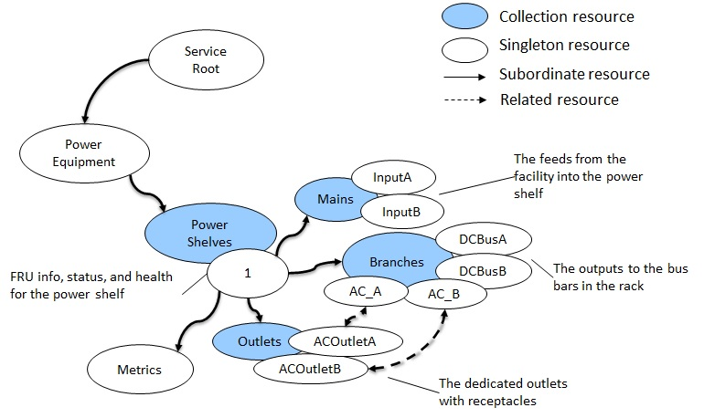
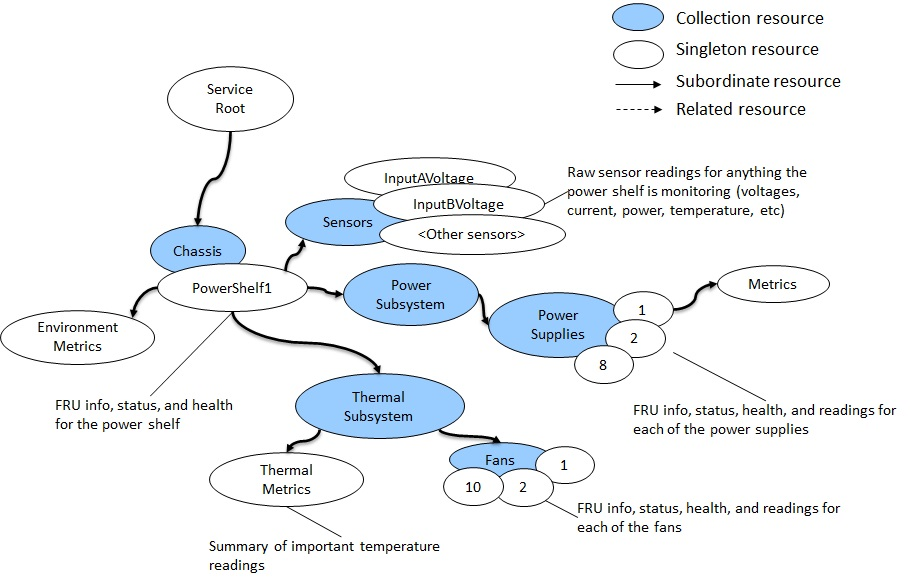

# Scope

This document references requirements and provide the usage examples for the OCP Power Shelf Management API v1.0.0.

# Requirements

As a Redfish-based interface, the required Redfish interface model elements are specified in a profile document.
For the Power Shelf Management API v1.0.0, the profile is located at: <TBD>

The Redfish Interop Validator is an open-source conformance test that reads the profile, executes the tests against an implementation, and generates a test report in text or HTML format.

```
> python3 RedfishInteropValidator.py -u user -p password -r host:port profileName
```

The Redfish Interop Validator is located at https://github.com/DMTF/Redfish-Interop-Validator.

The Power Shelf Management v1.0.0 profile extends from the Baseline Hardware Management v1.0.1 profile.
This extension is specified directly in the profile.
This means that the switch profile specifies conformance to the baseline profile in addition to any requirements specified in the Power Shelf Management profile.

```
"RequiredProfiles": {
    "OCPBaselineHardwareManagement": {
        "MinVersion": "1.0.1"
    }
},
```

# Capabilities

The following use cases are enabled by conformance to this Power Shelf Management profile.
The Power Shelf Management profile is extended from the Baseline Hardware Management profile.
The following table lists the capabilities provide the baseline profile requirements.
These capabilities are described in the "Usage Guide and Requirements for the OCP Baseline Hardware Management Profile v1.0.1" document.

| Use Case              | Management Task          | Requirement |
| :---                  | :---------               | :---        |
| Account Management    | Get accounts             | Mandatory |
| Session Management    | Get sessions             | Mandatory |
| Hardware Inventory    | Get FRU info             | Mandatory |
|                       | Get and set asset tag    | Recommended |
| Hardware Location     | Get and set location LED | Recommended |
| Status                | Get chassis status       | Mandatory |
| Power                 | Get power state          | Mandatory |
|                       | Get power usage          | Recommended |
|                       | Get power limit          | Recommended |
| Temperature           | Get the temperature      | If implemented, mandatory |
| Cooling               | Get fan speeds           | If implemented, mandatory |
|                       | Get fan redundancy       | If implemented, recommended |
| Log                   | Get log entry            | Mandatory |
|                       | Clear the log            | Recommended |
| Management Controller | Get firmware version     | Mandatory |
|                       | Get controller status    | Mandatory |
|                       | Get network info         | Mandatory |
|                       | Reset controller         | Mandatory |

The following table lists the capabilities prescribed in the Power Shelf Management profile.

| Use Case             | Management Task                                             | Requirement |
| :---                 | :---------                                                  | :---        |
| Power                | [Get power supply info](#get-the-power-supply-info)         | Mandatory |
|                      | [Get power supply redundancy](#get-power-supply-redundancy) | If implemented, mandatory |
|                      | [Get power supply metrics](#get-power-supply-metrics)       | Mandatory |
|                      | [Get/set power supply LED](#getset-power-supply-led)        | Mandatory |
|                      | [Get power consumption](#get-power-consumption)             | Mandatory |
| Temperature          | [Get the temperature](#get-the-temperature)                 | If implemented, mandatory |
| Cooling              | [Get fan speeds](#get-fan-speeds)                           | If implemented, mandatory |
|                      | [Get fan redundancy](#get-fan-redundancy)                   | If implemented, mandatory |
| Power Equipment      | [Get power shelf info](#get-power-shelf-info)               | Mandatory |
|                      | [Get power shelf metrics](#get-power-shelf-metrics)         | Mandatory |
|                      | [Get main circuits](#get-main-circuits)                     | Mandatory |
|                      | [Get branch circuits](#get-branch-circuits)                 | Mandatory |
|                      | [Get outlets](#get-outlets)                                 | If implemented, mandatory |

Figure 1 shows a diagram of the power distribution unit model for a power shelf, which represents the functional view of the power shelf.
Figure 2 shows a diagram of the chassis model for a power shelf, which represents the physical view of the power shelf.

|  |
| :--------: |
| *Figure 1* |

|  |
| :--------: |
| *Figure 2* |

# Use Cases

This section describes how each capability is accomplished by interacting with the Redfish service.

## Get the power supply info

The `PowerSupply` resource represents a power supply within a power shelf.
For the full schema definition, see the `PowerSupply` section of the reference guide in the [*Redfish Data Model Specification*](https://www.dmtf.org/dsp/DSP0268).

```
GET /redfish/v1/Chassis/PowerShelf/PowerSubsystem/PowerSupplies/1

{
    "@odata.id": "/redfish/v1/Chassis/PowerShelf/PowerSubsystem/PowerSupplies/1",
    "@odata.type": "#PowerSupply.v1_5_2.PowerSupply",
    "Id": "1",
    "Name": "Power Supply 1",
    "Status": {
        "State": "Enabled",
        "Health": "OK"
    },
    "LineInputStatus": "Normal",
    "Model": "MODEL STRING",
    "Manufacturer": "MANUFACTURER STRING",
    "FirmwareVersion": "FW VERSION STRING",
    "SerialNumber": "SERIAL NUMBER STRING",
    "PartNumber": "PART NUMBER STRING",
    "Version": "HARDWARE VERSION STRING",
    "ProductionDate": "2023-08-01T08:00:00Z",
    "LocationIndicatorActive": false,
    "PowerCapacityWatts": 2000,
    "PowerSupplyType": "AC",
    "InputRanges": [
        {
            "NominalVoltageType": "AC200To240V",
            "CapacityWatts": 2000
        },
        {
            "NominalVoltageType": "AC120V",
            "CapacityWatts": 1200
        }
    ],
    "EfficiencyRatings": [
        {
            "LoadPercent": 50,
            "EfficiencyPercent": 85
        },
        {
            "LoadPercent": 90,
            "EfficiencyPercent": 95
        }
    ],
    "OutputRails": [
        {
            "NominalVoltage": 48,
            "PhysicalContext": "DCBus"
        }
    ],
    "Location": {
        "PartLocation": {
            "ServiceLabel": "PSU 1",
            "LocationType": "Bay",
            "LocationOrdinalValue": 0,
            "Reference": "Back",
            "Orientation": "LeftToRight"
        }
    },
    "Metrics": {
        "@odata.id": "/redfish/v1/Chassis/PowerShelf/PowerSubsystem/PowerSupplies/1/Metrics"
    }
}
```

## Get power supply redundancy

The `PowerSubsystem` resource contains power supply redundancy info within the `PowerSupplyRedundancy` property.
For the full schema definition, see the `PowerSubsystem` section of the reference guide in the [*Redfish Data Model Specification*](https://www.dmtf.org/dsp/DSP0268).

```
GET /redfish/v1/Chassis/PowerShelf/PowerSubsystem

{
    "@odata.id": "/redfish/v1/Chassis/PowerShelf/PowerSubsystem",
    "@odata.type": "#PowerSubsystem.v1_1_0.PowerSubsystem",
    "Id": "PowerSubsystem",
    "Name": "Power Subsystem for the power shelf",
    "CapacityWatts": 8000,
    "PowerSupplyRedundancy": [
        {
            "RedundancyType": "NPlusM",
            "MaxSupportedInGroup": 4,
            "MinNeededInGroup": 2,
            "RedundancyGroup": [
                {
                    "@odata.id": "/redfish/v1/Chassis/PowerShelf/PowerSubsystem/PowerSupplies/1"
                },
                {
                    "@odata.id": "/redfish/v1/Chassis/PowerShelf/PowerSubsystem/PowerSupplies/2"
                },
                {
                    "@odata.id": "/redfish/v1/Chassis/PowerShelf/PowerSubsystem/PowerSupplies/3"
                },
                {
                    "@odata.id": "/redfish/v1/Chassis/PowerShelf/PowerSubsystem/PowerSupplies/4"
                }
            ],
            "Status": {
                "State": "Disabled",
                "Health": "OK"
            }
        }
    ],
    "PowerSupplies": {
        "@odata.id": "/redfish/v1/Chassis/PowerShelf/PowerSubsystem/PowerSupplies"
    }
}
```

## Get power supply metrics

The `PowerSupplyMetrics` resource represents metrics for a power supply within a power shelf.
For the full schema definition, see the `PowerSupplyMetrics` section of the reference guide in the [*Redfish Data Model Specification*](https://www.dmtf.org/dsp/DSP0268).

```
GET /redfish/v1/Chassis/PowerShelf/PowerSubsystem/PowerSupplies/1/Metrics

{
    "@odata.id": "/redfish/v1/Chassis/PowerShelf/PowerSubsystem/PowerSupplies/Bay1/Metrics"
    "@odata.type": "#PowerSupplyMetrics.v1_1_0.PowerSupplyMetrics",
    "Id": "Metrics",
    "Name": "Metrics for Power Supply 1",
    "Status": {
        "State": "Enabled",
        "Health": "OK"
    },
    "InputVoltage": {
        "DataSourceUri": "/redfish/v1/Chassis/PowerShelf/Sensors/PS1InputVoltage",
        "Reading": 230.2
    },
    "InputCurrentAmps": {
        "DataSourceUri": "/redfish/v1/Chassis/PowerShelf/Sensors/PS1InputCurrent",
        "Reading": 5.19
    },
    "InputPowerWatts": {
        "DataSourceUri": "/redfish/v1/Chassis/PowerShelf/Sensors/PS1InputPower",
        "Reading": 937.4
    },
    "RailVoltage": [
        {
            "DataSourceUri": "/redfish/v1/Chassis/PowerShelf/Sensors/PS1_120VOutput",
            "Reading": 122.3
        },
        {
            "DataSourceUri": "/redfish/v1/Chassis/PowerShelf/Sensors/PS1_DCVOutput",
            "Reading": 49.03
        }
    ],
    "RailCurrentAmps": [
        {
            "DataSourceUri": "/redfish/v1/Chassis/PowerShelf/Sensors/PS1_120VCurrent",
            "Reading": 9.84
        },
        {
            "DataSourceUri": "/redfish/v1/Chassis/PowerShelf/Sensors/PS1_DCCurrent",
            "Reading": 15.25
        }
    ],
    "OutputPowerWatts": {
        "DataSourceUri": "/redfish/v1/Chassis/PowerShelf/Sensors/PS1OutputPower",
        "Reading": 937.4
    },
    "TemperatureCelsius": {
        "DataSourceUri": "/redfish/v1/Chassis/PowerShelf/Sensors/PS1Temp",
        "Reading": 43.9
    }
}
```

## Get/set power supply LED

The `PowerSupply` resource contains an `LocationIndicatorActive` property, which represents the location indicator LED for a power supply within a power shelf.
For the full schema definition, see the `PowerSupply` section of the reference guide in the [*Redfish Data Model Specification*](https://www.dmtf.org/dsp/DSP0268).

```
GET /redfish/v1/Chassis/PowerShelf/PowerSubsystem/PowerSupplies/1

{
    "@odata.id": "/redfish/v1/Chassis/PowerShelf/PowerSubsystem/PowerSupplies/1",
    "@odata.type": "#PowerSupply.v1_5_2.PowerSupply",
    "Id": "1",
    "Name": "Power Supply 1",
    "LocationIndicatorActive": false,
    ...
}
```

```
PATCH /redfish/v1/Chassis/PowerShelf/PowerSubsystem/PowerSupplies/1

{
    "LocationIndicatorActive": true
}
```

## Get power consumption

The `EnvironmentMetrics` resource subordinate to the `Chassis` resource contains the overall metrics of the enclosure, such as power consumption.
For the full schema definition, see the `EnvironmentMetrics` section of the reference guide in the [*Redfish Data Model Specification*](https://www.dmtf.org/dsp/DSP0268).

```
GET /redfish/v1/Chassis/PowerShelf/EnvironmentMetrics

{
    "@odata.id": "/redfish/v1/Chassis/PowerShelf/EnvironmentMetrics",
    "@odata.type": "#EnvironmentMetrics.v1_3_0.EnvironmentMetrics",
    "Name": "Chassis Environment Metrics",
    "PowerWatts": {
        "DataSourceUri": "/redfish/v1/Chassis/PowerShelf/Sensors/ShelfPower",
        "Reading": 6438,
        "ApparentVA": 6300,
        "ReactiveVAR": 100,
        "PowerFactor": 0.93
    },
    ...
}
```

## Get the temperature

The `EnvironmentMetrics` resource subordinate to the `Chassis` resource contains the overall metrics of the enclosure, such as the temperature.
For the full schema definition, see the `EnvironmentMetrics` section of the reference guide in the [*Redfish Data Model Specification*](https://www.dmtf.org/dsp/DSP0268).

```
GET /redfish/v1/Chassis/PowerShelf/EnvironmentMetrics

{
    "@odata.id": "/redfish/v1/Chassis/PowerShelf/EnvironmentMetrics",
    "@odata.type": "#EnvironmentMetrics.v1_3_0.EnvironmentMetrics",
    "Name": "Chassis Environment Metrics",
    "TemperatureCelsius": {
        "Reading": 39,
        "DataSourceUri": "/redfish/v1/Chassis/PowerShelf/Sensors/ChassisTemp"
    },
    ...
}
```

## Get fan speeds

The `Fan` resource represents a fan within a power shelf.
For the full schema definition, see the `Fan` section of the reference guide in the [*Redfish Data Model Specification*](https://www.dmtf.org/dsp/DSP0268).

```
GET /redfish/v1/Chassis/PowerShelf/ThermalSubsystem/Fans/1

{
    "@odata.id": "/redfish/v1/Chassis/PowerShelf/ThermalSubsystem/Fans/1"
    "@odata.type": "#Fan.v1_5_0.Fan",
    "Id": "1",
    "Name": "Fan 1",
    "Status": {
        "State": "Enabled",
        "Health": "OK"
    },
    "SpeedPercent": {
        "Reading": 45,
        "SpeedRPM": 2200,
        "DataSourceUri": "/redfish/v1/Chassis/1U/Sensors/Fan1Speed"
    },
    "Location": {
        "PartLocation": {
            "ServiceLabel": "Fan 1",
            "LocationType": "Bay",
            "LocationOrdinalValue": 0,
            "Reference": "Front",
            "Orientation": "LeftToRight"
        }
    }
}
```

## Get fan redundancy

The `ThermalSubsystem` resource contains fan redundancy info within the `FanRedundancy` property.
For the full schema definition, see the `ThermalSubsystem` section of the reference guide in the [*Redfish Data Model Specification*](https://www.dmtf.org/dsp/DSP0268).

```
GET /redfish/v1/Chassis/PowerShelf/ThermalSubsystem

{
    "@odata.id": "/redfish/v1/Chassis/PowerShelf/ThermalSubsystem",
    "@odata.type": "#ThermalSubsystem.v1_3_0.ThermalSubsystem",
    "Id": "ThermalSubsystem",
    "Name": "Thermal Subsystem for the power shelf",
    "FanRedundancy": [
        {
            "RedundancyType": "NPlusM",
            "MaxSupportedInGroup": 6,
            "MinNeededInGroup": 5,
            "RedundancyGroup": [
                {
                    "@odata.id": "/redfish/v1/Chassis/PowerShelf/ThermalSubsystem/Fans/1"
                },
                {
                    "@odata.id": "/redfish/v1/Chassis/PowerShelf/ThermalSubsystem/Fans/2"
                },
                {
                    "@odata.id": "/redfish/v1/Chassis/PowerShelf/ThermalSubsystem/Fans/3"
                },
                {
                    "@odata.id": "/redfish/v1/Chassis/PowerShelf/ThermalSubsystem/Fans/4"
                },
                {
                    "@odata.id": "/redfish/v1/Chassis/PowerShelf/ThermalSubsystem/Fans/5"
                },
                {
                    "@odata.id": "/redfish/v1/Chassis/PowerShelf/ThermalSubsystem/Fans/6"
                }
            ],
            "Status": {
                "State": "Enabled",
                "Health": "OK"
            }
        }
    ],
    "Fans": {
        "@odata.id": "/redfish/v1/Chassis/PowerShelf/ThermalSubsystem/Fans"
    },
    "ThermalMetrics": {
        "@odata.id": "/redfish/v1/Chassis/PowerShelf/ThermalSubsystem/ThermalMetrics"
    }
}
```

## Get power shelf info

The `PowerDistribution` resource represents the functional view of the power shelf.
For the full schema definition, see the `PowerDistribution` section of the reference guide in the [*Redfish Data Model Specification*](https://www.dmtf.org/dsp/DSP0268).

```
GET /redfish/v1/PowerEquipment/PowerShelves/1

{
    "@odata.id": "/redfish/v1/PowerEquipment/PowerShelves/1",
    "@odata.type": "#PowerDistribution.v1_3_2.PowerDistribution",
    "Id": "1",
    "EquipmentType": "PowerShelf",
    "Name": "Power Shelf 1",
    "FirmwareVersion": "FW VERSION",
    "Version": "HW VERSION",
    "ProductionDate": "2023-08-01T08:00:00Z",
    "Manufacturer": "MANUFACTURER",
    "Model": "MODEL",
    "SerialNumber": "SERIAL NUMBER",
    "PartNumber": "PART NUMBER",
    "UUID": "32354641-4135-4332-4a35-313735303734",
    "Status": {
        "State": "Enabled",
        "Health": "OK"
    },
    "MainsRedundancy": {
        "RedundancyType": "Sharing",
        "MaxSupportedInGroup": 2,
        "MinNeededInGroup": 1,
        "RedundancyGroup": [
            {
                "@odata.id": "/redfish/v1/PowerEquipment/PowerShelves/1/Mains/AC1"
            },
            {
                "@odata.id": "/redfish/v1/PowerEquipment/PowerShelves/1/Mains/AC2"
            }
        ],
        "Status": {
            "State": "Enabled",
            "Health": "OK"
        }
    },
    "Mains": {
        "@odata.id": "/redfish/v1/PowerEquipment/PowerShelves/1/Mains"
    },
    "Branches": {
        "@odata.id": "/redfish/v1/PowerEquipment/PowerShelves/1/Branches"
    },
    "Outlets": {
        "@odata.id": "/redfish/v1/PowerEquipment/PowerShelves/1/Outlets"
    },
    "Metrics": {
        "@odata.id": "/redfish/v1/PowerEquipment/PowerShelves/1/Metrics"
    },
    "Links": {
        "Chassis": [
            {
                "@odata.id": "/redfish/v1/Chassis/PowerShelf"
            }
        ]
    }
}
```

## Get power shelf metrics

The `PowerDistributionMetrics` resource contains the overall metrics for the power shelf.
For the full schema definition, see the `PowerDistributionMetrics` section of the reference guide in the [*Redfish Data Model Specification*](https://www.dmtf.org/dsp/DSP0268).

```
GET /redfish/v1/PowerEquipment/PowerShelves/1/Metrics

{
    "@odata.id": "/redfish/v1/PowerEquipment/PowerShelves/1/Metrics",
    "@odata.type": "#PowerDistributionMetrics.v1_3_0.PowerDistributionMetrics",
    "Id": "Metrics",
    "Name": "Metrics for Power Shelf 1",
    "PowerWatts": {
        "DataSourceUri": "/redfish/v1/Chassis/PowerShelf/Sensors/ShelfPower",
        "Reading": 6438,
        "ApparentVA": 6300,
        "ReactiveVAR": 100,
        "PowerFactor": 0.93
    },
    "EnergykWh": {
        "DataSourceUri": "/redfish/v1/Chassis/PowerShelf/Sensors/ShelfEnergy",
        "Reading": 56438
    },
    "TemperatureCelsius": {
        "DataSourceUri": "/redfish/v1/Chassis/PowerShelf/Sensors/ShelfTemp",
        "Reading": 31
    },
    "PowerLoadPercent": {
        "Reading": 55
    },
    "Actions": {
        "#PowerDistributionMetrics.ResetMetrics": {
            "target": "/redfish/v1/PowerEquipment/PowerShelves/1/Metrics/PowerDistributionMetrics.ResetMetrics"
        }
    }
}
```

## Get main circuits

The `Circuit` resources in the `Mains` collection represents the inputs to the power shelf with associated readings.
For the full schema definition, see the `Circuit` section of the reference guide in the [*Redfish Data Model Specification*](https://www.dmtf.org/dsp/DSP0268).

```
GET /redfish/v1/PowerEquipment/PowerShelves/1/Mains/AC1

{
    "@odata.id": "/redfish/v1/PowerEquipment/PowerShelves/1/Mains/AC1",
    "@odata.type": "#Circuit.v1_7_0.Circuit",
    "Id": "AC1",
    "Name": "Mains AC Input #1",
    "Status": {
        "State": "Enabled",
        "Health": "OK"
    },
    "CircuitType": "Mains",
    "PhaseWiringType": "OnePhase3Wire",
    "ElectricalContext": "Total",
    "RatedCurrentAmps": 20,
    "NominalVoltage": "AC200To240V",
    "VoltageType": "AC",
    "Voltage": {
        "DataSourceUri": "/redfish/v1/Chassis/PowerShelf/Sensors/VoltageMains1",
        "Reading": 222.8
    },
    "CurrentAmps": {
        "DataSourceUri": "/redfish/v1/Chassis/PowerShelf/Sensors/CurrentMains1",
        "Reading": 5.68
    },
    "PowerWatts": {
        "DataSourceUri": "/redfish/v1/Chassis/PowerShelf/Sensors/PowerMains1",
        "Reading": 897.4,
        "ApparentVA": 897.4,
        "ReactiveVAR": 0.1,
        "PowerFactor": 0.99
    },
    "FrequencyHz": {
        "DataSourceUri": "/redfish/v1/Chassis/PowerShelf/Sensors/FreqMains1",
        "Reading": 60.1
    },
    "Links": {
        "PowerOutlet": {
            "@odata.id": "/redfish/v1/PowerEquipment/ElectricalBuses/Busway/Outlets/A4"
        },
        "SourceCircuit": {
            "@odata.id": "/redfish/v1/PowerEquipment/ElectricalBuses/Busway/Branches/A4"
        }
    }
}
```

## Get branch circuits

The `Circuit` resources in the `Branches` collection represents the outputs from the power shelf with associated readings.
For the full schema definition, see the `Circuit` section of the reference guide in the [*Redfish Data Model Specification*](https://www.dmtf.org/dsp/DSP0268).

```
GET /redfish/v1/PowerEquipment/PowerShelves/1/Branches/DC

{
    "@odata.id": "/redfish/v1/PowerEquipment/PowerShelves/1/Branches/DC",
    "@odata.type": "#Circuit.v1_7_0.Circuit",
    "Id": "DC",
    "Name": "DC Output Circuit to Busbar",
    "Status": {
        "State": "Enabled",
        "Health": "OK"
    },
    "CircuitType": "Bus",
    "ElectricalContext": "Total",
    "NominalVoltage": "DC48V",
    "RatedCurrentAmps": 250,
    "BreakerState": "Normal",
    "VoltageType": "DC",
    "Voltage": {
        "DataSourceUri": "/redfish/v1/Chassis/PowerShelf/Sensors/VoltageDC",
        "Reading": 48.45
    },
    "CurrentAmps": {
        "DataSourceUri": "/redfish/v1/Chassis/PowerShelf/Sensors/CurrentDC",
        "Reading": 16.93
    },
    "PowerWatts": {
        "DataSourceUri": "/redfish/v1/Chassis/PowerShelf/Sensors/PowerDC",
        "Reading": 816.5
    },
    "EnergykWh": {
        "DataSourceUri": "/redfish/v1/Chassis/PowerShelf/Sensors/EnergyDC",
        "Reading": 121666
    },
    "Links": {
        "DistributionCircuits": [
            {
                "@odata.id": "/redfish/v1/PowerEquipment/ElectricalBuses/Rack42Busbar/Mains/DC"
            }
        ]
    }
}
```

## Get outlets

The `Outlet` resources in the `Outlets` collection represents recepticals directly connected to equipment from the power shelf with associated readings.
For the full schema definition, see the `Outlet` section of the reference guide in the [*Redfish Data Model Specification*](https://www.dmtf.org/dsp/DSP0268).

```
GET /redfish/v1/PowerEquipment/PowerShelves/1/Outlets/A1

{
    "@odata.id": "/redfish/v1/PowerEquipment/PowerShelves/1/Outlets/A1",
    "@odata.type": "#Outlet.v1_4_1.Outlet",
    "Id": "A1",
    "Name": "Outlet A1",
    "Status": {
        "Health": "OK",
        "State": "Enabled"
    },
    "PhaseWiringType": "OnePhase3Wire",
    "VoltageType": "AC",
    "OutletType": "NEMA_5_15R",
    "RatedCurrentAmps": 15,
    "NominalVoltage": "AC120V",
    "LocationIndicatorActive": true,
    "PowerOnDelaySeconds": 4,
    "PowerOffDelaySeconds": 0,
    "PowerState": "On",
    "PowerEnabled": true,
    "Voltage": {
        "DataSourceUri": "/redfish/v1/Chassis/PowerShelf/Sensors/VoltageA",
        "Reading": 121.4
    },
    "CurrentAmps": {
        "DataSourceUri": "/redfish/v1/Chassis/PowerShelf/Sensors/CurrentA",
        "Reading": 1.59
    },
    "PowerWatts": {
        "DataSourceUri": "/redfish/v1/Chassis/PowerShelf/Sensors/PowerA",
        "Reading": 192.4
    },
    "Links": {
        "BranchCircuit": {
            "@odata.id": "/redfish/v1/PowerEquipment/PowerShelves/1/Branches/A"
        }
    }
}
```

# References

\[1\] Usage Guide and Requirements for the OCP Baseline Hardware Management Profile v1.0.1
\[2\] "Redfish Specification" - [*https://www.dmtf.org/dsp/DSP0266*](https://www.dmtf.org/dsp/DSP0266)
\[3\] "Redfish Data Model Specification" - [*https://www.dmtf.org/dsp/DSP0268*](https://www.dmtf.org/dsp/DSP0268)
\[4\] "Redfish Interoperability Profiles Specification" - [*https://www.dmtf.org/dsp/DSP0270*](https://www.dmtf.org/dsp/DSP0270)

# Revision 

| Revision | Date       | Description |
| :---     | :---       | :---        |
| 0.9.0    | 2023-08-18 | Initial draft |