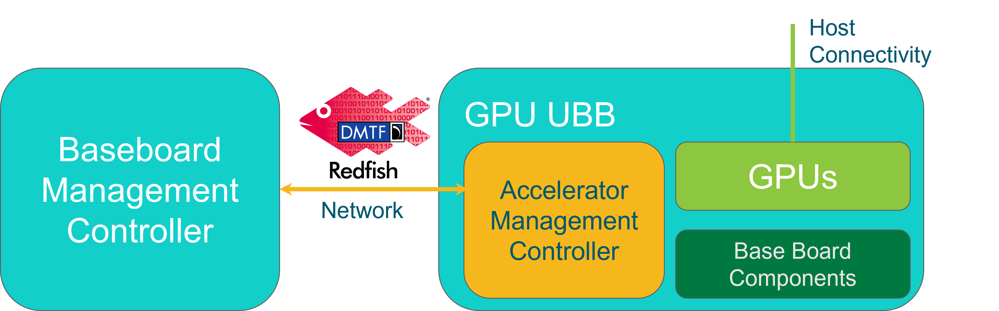
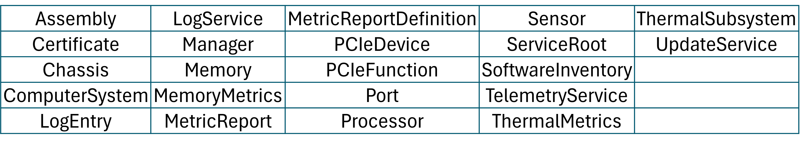
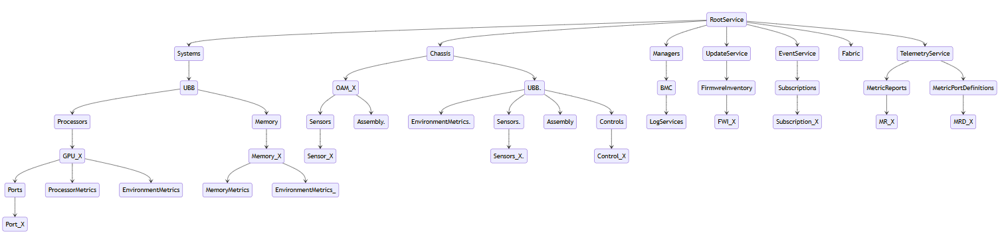

# Scope

This document contains baseline requirements for the OCP GPU Universal Baseboard Management API v1.0.
The baseline Universal Base Board management tasks set as a common set of manageability from which OCP UBB platforms can extend for specific usages.

# Requirements

As a Redfish-based interface, the required Redfish interface model elements are specified in a corresponding profile document.
For the Baseline GPU Management API v1.0

The Redfish Interop Validator is an open-source conformance test that reads the profile, executes the tests against an implementation, and generates a test report in text or HTML forma

```

> python3 RedfishInteropValidator.py -u user -p password -r host:port profileName

```

The Redfish Interop Validator is located at <https://github.com/DMTF/Redfish-Interop-Validator>.

# Overview

## GPU Universal Base Board

- ["OCP HGX"](https://www.opencompute.org/documents/open-compute-specification-hgx-baseboard-contribution-r1-v0-1-pdf) defines the hardware for a UBB for GPUs
- UBB can be described as tray which consists of base board and a set of OAM/high-speed with the necessary high-speed interconnect and other I/O devices  
- As per OCP HGX, GPU UBBs contain an Accelerator Management Controller (AMC)
- The UBB AMC is managed directly via Redfish interface to an enclosure management controller



## List of Resources included in the Profile 




## UBB Management Redfish Model



## GPU Profile Use Cases

- Requirements
  - Standardize (Required, Recommended and Optional) Redfish Resources and Properties
    - Provided by GPU platform vendors
    - Required by Hyperscalers
- Publish Standard OEM Features
  - Vendors to publish available OEM features
  - Hyperscalers to publish their required OEM features
- Validation
  - Vendors can utilize the Redfish Interoperability Validator to provide compliance to the RIP
- Compliance
  - Hyperscalers can utilize the Redfish Interoperability Validator to test compliance against RIP


## Validating conformance

The profile file can be read by the open-source conformance test, Redfish Interop Validator [3].
The validator will auto-generate tests, execute the tests against an implementation, and create a test report.

# References

\[1\] "OCP UBB Baseline Management Profile v1.0.0" - ["OCP_UBB_BaselineManagement.v1.0.0.json"](OCP_UBB_BaselineManagement.v1.0.0.json)

\[2\] "Redfish Specification" - [*https://www.dmtf.org/dsp/DSP0266*](https://www.dmtf.org/dsp/DSP0266)

\[3\] "Redfish Data Model Specification" - [*https://www.dmtf.org/dsp/DSP0268*](https://www.dmtf.org/dsp/DSP0268)

\[4\] "Redfish Interoperability Profiles Specification" - [*https://www.dmtf.org/dsp/DSP0270*](https://www.dmtf.org/dsp/DSP0270)

# Revision 

| Revision | Date       | Description |
| :---     | :---       | :---        |
| 1.0.0    | TBD        | Initial release. |